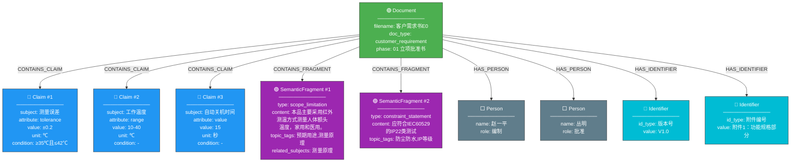
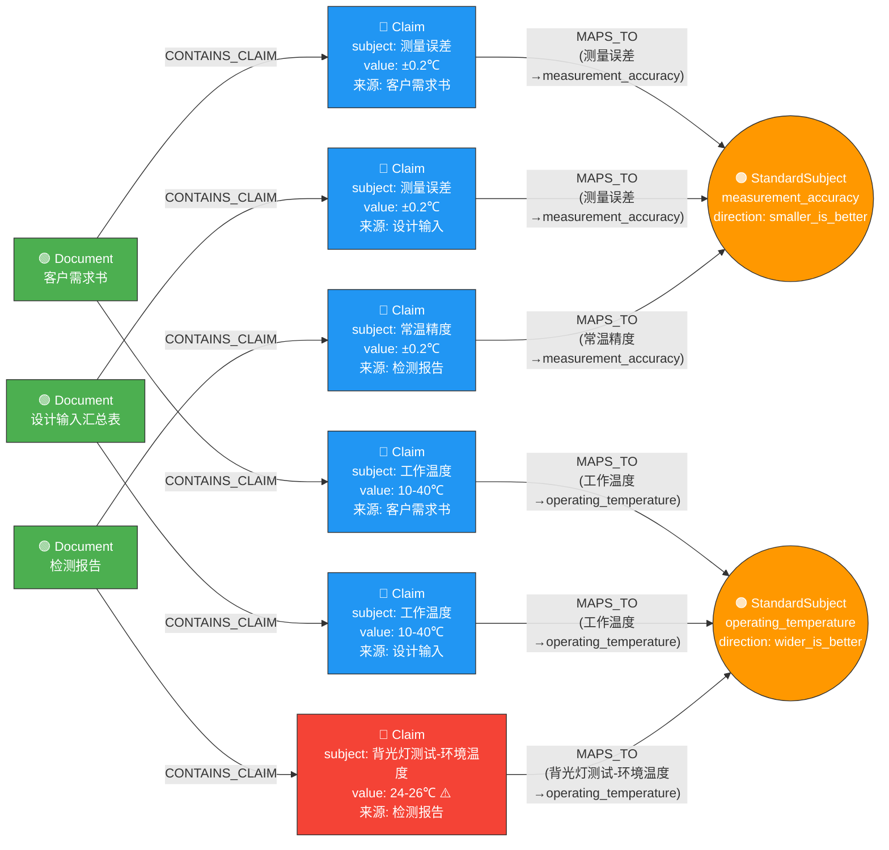
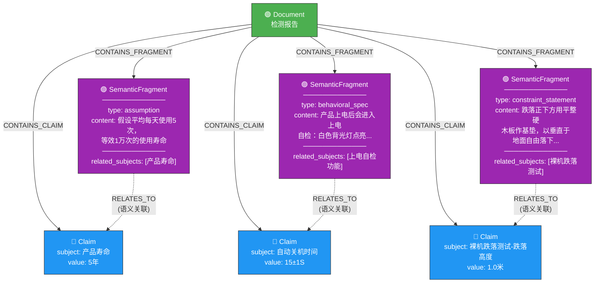
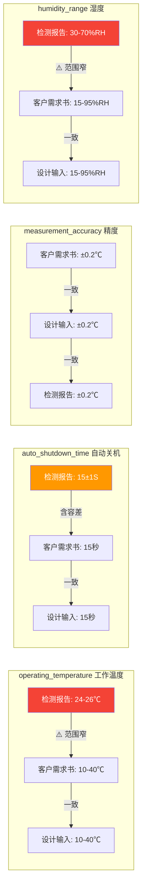

# POC 详细过程报告

> DeepSeek Chat API | 3 份文件 | 全流程验证

---

## 一、输入文件

| # | 文件名 | 来源目录 | 大小 |
|---|--------|----------|------|
| 1 | PT9L红外体温计检测报告 V1.0.via_lo_html.clean.md | 11 T1样机 | 9,923 bytes |
| 2 | 客户需求书E0-血压计 23.6.via_xlsx.clean.md | 01 立项批准书E0 23.11 | 9,339 bytes |
| 3 | 设计输入汇总表E0  20211118.via_xlsx.clean.md | 04 设计输入E0 23.11 | 22,379 bytes |

---

## 二、Step 1 信息抽取详细结果

### 文件: PT9L红外体温计检测报告 V1.0.via_lo_html.clean.md

- Claims: **77** 个
- SemanticFragments: **15** 个
- Identifiers: **5** 个
- Persons: **3** 个

#### Claims 完整列表:

| # | subject | attribute | value | unit | condition | source_section |
|---|---------|-----------|-------|------|-----------|----------------|
| 1 | 上电自检功能-蜂鸣器响时间 | value | 0.5 | S | - | 文件开头 > 四、测试项目及结果 > 常温检验 > |
| 2 | 上电自检功能-进入待机模式时间 | value | 2 | S | - | 文件开头 > 四、测试项目及结果 > 常温检验 > |
| 3 | 自动关机时间 | value | 15±1 | S | 测温后无操作 | 文件开头 > 四、测试项目及结果 > 常温检验 > |
| 4 | 温度显示范围 | range | 32-42.9 | ℃ | - | 文件开头 > 四、测试项目及结果 > 常温检验 > |
| 5 | 温度显示范围-下限报错 | threshold | 31.6 | ℃ | 低于32℃ | 文件开头 > 四、测试项目及结果 > 常温检验 > |
| 6 | 温度显示范围-上限报错 | threshold | 43.4 | ℃ | 高于42.9℃ | 文件开头 > 四、测试项目及结果 > 常温检验 > |
| 7 | 显示分辨率 | value | 0.1 | ℃ | - | 文件开头 > 四、测试项目及结果 > 常温检验 > |
| 8 | 显示分辨率-黑体温度变化 | range | 0.1-0.15 | ℃ | 实验室环境中 | 文件开头 > 四、测试项目及结果 > 常温检验 > |
| 9 | 常温精度测试-环境温度 | range | 23.0±2.0 | ℃ | - | 文件开头 > 四、测试项目及结果 > 常温检验 > |
| 10 | 常温精度测试-环境湿度 | range | 50±20 | %RH | - | 文件开头 > 四、测试项目及结果 > 常温检验 > |
| 11 | 常温精度 | tolerance | ±0.2 | ℃ | ≥35℃且≤42℃ | 文件开头 > 四、测试项目及结果 > 常温检验 > |
| 12 | 常温精度 | tolerance | ±0.3 | ℃ | 其它（<35℃或>42℃） | 文件开头 > 四、测试项目及结果 > 常温检验 > |
| 13 | 低电压提示-正常测量电压 | threshold | 3.0 | V | - | 文件开头 > 四、测试项目及结果 > 常温检验 > |
| 14 | 低电压提示-低电符号显示电压 | threshold | 2.7 | V | 低于2.7V | 文件开头 > 四、测试项目及结果 > 常温检验 > |
| 15 | 低电压提示-自动关机电压 | threshold | 2.5 | V | 低于2.5V | 文件开头 > 四、测试项目及结果 > 常温检验 > |
| 16 | 低电压提示-自动关机时间 | value | 15 | S | 电压低于2.5V | 文件开头 > 四、测试项目及结果 > 常温检验 > |
| 17 | 背光灯测试-环境温度 | range | 24-26 | ℃ | - | 文件开头 > 四、测试项目及结果 > 常温检验 > |
| 18 | 背光灯测试-环境湿度 | range | 30-70 | %RH | - | 文件开头 > 四、测试项目及结果 > 常温检验 > |
| 19 | 静态电流 | value | 0.02 | mA | 睡眠状态 | 文件开头 > 四、测试项目及结果 > 常温检验 > |
| 20 | 静态电流-实测值 | value | 8.1 | uA | - | 文件开头 > 四、测试项目及结果 > 常温检验 > |
| 21 | 工作电流 | value | 20 | mA | 工作中任意状态 | 文件开头 > 四、测试项目及结果 > 常温检验 > |
| 22 | 工作电流-实测值 | value | 12.7 | mA | - | 文件开头 > 四、测试项目及结果 > 常温检验 > |
| 23 | 裸机跌落测试-跌落高度 | value | 1.0 | 米 | - | 文件开头 > 四、测试项目及结果 > 常温检验 > |
| 24 | 裸机跌落测试-跌落次数 | count | 3 | 次 | - | 文件开头 > 四、测试项目及结果 > 常温检验 > |
| 25 | 裸机跌落测试-木板密度 | value | 700 | kg/M3 | - | 文件开头 > 四、测试项目及结果 > 常温检验 > |
| 26 | 裸机跌落测试-木板厚度 | value | 50 | mm | - | 文件开头 > 四、测试项目及结果 > 常温检验 > |
| 27 | 带包装振动-频率范围 | range | 5-35-5 | Hz | - | 文件开头 > 四、测试项目及结果 > 常温检验 > |
| 28 | 带包装振动-振幅 | value | 0.35 | mm | - | 文件开头 > 四、测试项目及结果 > 常温检验 > |
| 29 | 带包装振动-振动次数 | count | 15 | 次 | 每个方向 | 文件开头 > 四、测试项目及结果 > 常温检验 > |
| 30 | 低温工作试验-温度范围 | range | 10-40 | ℃ | - | 文件开头 > 四、测试项目及结果 > 常温检验 > |
| 31 | 低温工作试验-湿度 | threshold | ≤95 | %RH | 不结露 | 文件开头 > 四、测试项目及结果 > 常温检验 > |
| 32 | 低温工作试验-大气压力 | range | 70-106 | kPa | - | 文件开头 > 四、测试项目及结果 > 常温检验 > |
| 33 | 低温工作试验-放置时间 | value | 24 | h | 10℃恒温箱 | 文件开头 > 四、测试项目及结果 > 常温检验 > |
| 34 | 低温工作试验-恢复时间 | value | 1 | h | 常温下 | 文件开头 > 四、测试项目及结果 > 常温检验 > |
| 35 | 高温工作试验-温度范围 | range | 10-40 | ℃ | - | 文件开头 > 四、测试项目及结果 > 常温检验 > |
| 36 | 高温工作试验-湿度 | threshold | ≤95 | %RH | 不结露 | 文件开头 > 四、测试项目及结果 > 常温检验 > |
| 37 | 高温工作试验-大气压力 | range | 70-106 | kPa | - | 文件开头 > 四、测试项目及结果 > 常温检验 > |
| 38 | 高温工作试验-放置时间 | value | 24 | h | 40℃恒温箱 | 文件开头 > 四、测试项目及结果 > 常温检验 > |
| 39 | 高温工作试验-恢复时间 | value | 1 | h | 常温下 | 文件开头 > 四、测试项目及结果 > 常温检验 > |
| 40 | 低温存储试验-温度范围 | range | -20-55 | ℃ | - | 文件开头 > 四、测试项目及结果 > 常温检验 > |
| 41 | 低温存储试验-湿度 | threshold | ≤95 | %RH | 不结露 | 文件开头 > 四、测试项目及结果 > 常温检验 > |
| 42 | 低温存储试验-大气压力 | range | 70-106 | kPa | - | 文件开头 > 四、测试项目及结果 > 常温检验 > |
| 43 | 低温存储试验-放置时间 | value | 48 | h | -20℃恒温箱 | 文件开头 > 四、测试项目及结果 > 常温检验 > |
| 44 | 低温存储试验-恢复时间 | value | 1 | h | 常温下 | 文件开头 > 四、测试项目及结果 > 常温检验 > |
| 45 | 高温存储试验-温度范围 | range | -20-55 | ℃ | - | 文件开头 > 四、测试项目及结果 > 常温检验 > |
| 46 | 高温存储试验-湿度 | threshold | ≤95 | %RH | 不结露 | 文件开头 > 四、测试项目及结果 > 常温检验 > |
| 47 | 高温存储试验-大气压力 | range | 70-106 | kPa | - | 文件开头 > 四、测试项目及结果 > 常温检验 > |
| 48 | 高温存储试验-放置时间 | value | 48 | h | 55℃恒温箱 | 文件开头 > 四、测试项目及结果 > 常温检验 > |
| 49 | 高温存储试验-恢复时间 | value | 1 | h | 常温下 | 文件开头 > 四、测试项目及结果 > 常温检验 > |
| 50 | 产品寿命 | value | 5 | 年 | - | 文件开头 > 四、测试项目及结果 > 常温检验 > |
| 51 | 产品寿命-使用次数 | count | 10000 | 次 | - | 文件开头 > 四、测试项目及结果 > 常温检验 > |
| 52 | 产品寿命-日均使用次数假设 | value | 5 | 次/天 | 假设 | 文件开头 > 四、测试项目及结果 > 常温检验 > |
| 53 | 电池寿命-测量次数 | count | 1000 | 次 | - | 文件开头 > 四、测试项目及结果 > 常温检验 > |
| 54 | 电池寿命-待机能力 | value | 6 | 个月 | - | 文件开头 > 四、测试项目及结果 > 常温检验 > |
| 55 | 测试环境温度 | value | 23 | ℃ | - | 文件开头 > 三、实际测试 |
| 56 | 测试环境湿度 | value | 55 | %RH | - | 文件开头 > 三、实际测试 |
| 57 | 测试样机数量 | count | 2 | 台 | - | 文件开头 > 三、实际测试 |
| 58 | 测量单位切换-长按时间进入 | value | 8 | 秒 | 待机状态下 | 文件开头 > 四、测试项目及结果 > 常温检验 > |
| 59 | 测量单位切换-长按时间确认 | value | 2 | 秒 | - | 文件开头 > 四、测试项目及结果 > 常温检验 > |
| 60 | 常温检验-室温 | value | 23 | ℃ | - | 文件开头 > 四、测试项目及结果 > 常温检验 |
| 61 | 常温检验-相对湿度 | value | 55 | %RH | - | 文件开头 > 四、测试项目及结果 > 常温检验 |
| 62 | 背光灯测试-34℃水槽背光颜色 | value | 白色 | - | 测试34℃水槽 | 文件开头 > 四、测试项目及结果 > 常温检验 > |
| 63 | 背光灯测试-35.7℃水槽背光 | value | 橙色 | - | 测试35.7℃水槽 | 文件开头 > 四、测试项目及结果 > 常温检验 > |
| 64 | 背光灯测试-37℃水槽背光颜色 | value | 红色 | - | 测试37℃水槽 | 文件开头 > 四、测试项目及结果 > 常温检验 > |
| 65 | 常温精度测试-水槽设定温度点 | value | 32 | ℃ | - | 文件开头 > 四、测试项目及结果 > 常温检验 > |
| 66 | 常温精度测试-水槽设定温度点 | value | 32.5 | ℃ | - | 文件开头 > 四、测试项目及结果 > 常温检验 > |
| 67 | 常温精度测试-水槽设定温度点 | value | 35 | ℃ | - | 文件开头 > 四、测试项目及结果 > 常温检验 > |
| 68 | 常温精度测试-水槽设定温度点 | value | 38.5 | ℃ | - | 文件开头 > 四、测试项目及结果 > 常温检验 > |
| 69 | 常温精度测试-水槽设定温度点 | value | 42 | ℃ | - | 文件开头 > 四、测试项目及结果 > 常温检验 > |
| 70 | 常温精度测试-水槽设定温度点 | value | 42.5 | ℃ | - | 文件开头 > 四、测试项目及结果 > 常温检验 > |
| 71 | 常温精度测试-水槽设定温度点 | value | 42.9 | ℃ | - | 文件开头 > 四、测试项目及结果 > 常温检验 > |
| 72 | 常温精度测试-连续测量次数 | count | 3 | 次 | - | 文件开头 > 四、测试项目及结果 > 常温检验 > |
| 73 | 常温精度测试-复测次数 | count | 2 | 次 | 测试结果不符合规定 | 文件开头 > 四、测试项目及结果 > 常温检验 > |
| 74 | 背光灯测试-连续测量次数 | count | 3 | 次 | - | 文件开头 > 四、测试项目及结果 > 常温检验 > |
| 75 | 背光灯测试-复测次数 | count | 2 | 次 | 测试结果不符合规定 | 文件开头 > 四、测试项目及结果 > 常温检验 > |
| 76 | 电源电压-测试条件 | value | 3.0 | V | 静态电流/工作电流测试 | 文件开头 > 四、测试项目及结果 > 常温检验 > |
| 77 | 振动方向 | value | X, Y, Z | - | - | 文件开头 > 四、测试项目及结果 > 常温检验 > |

#### SemanticFragments 列表:

| # | type | content(前50字) | topic_tags | related_subjects |
|---|------|----------------|------------|------------------|
| 1 | scope_limitation | PT9L进行到T1阶段，此次测试对PT9L的性能进行测试，测试依据为"PT9L红外体温计产品检验标准 | 测试背景, T1阶段, 性能测试 |  |
| 2 | scope_limitation | 恒温水槽、黑体辐射源。其中恒温水槽、黑体辐射源都需要符合"PT9L红外体温计产品检验标准"内的要求。 | 测试仪器, 恒温水槽, 黑体辐射源 |  |
| 3 | scope_limitation | 测试方法：见《PT9L红外体温计产品检验标准》 | 测试方法, 检验标准 |  |
| 4 | behavioral_spec | 产品上电后会进入上电自检：白色背光灯点亮，LCD显示屏全显，此时检查显示内容是否正确，是否有乱显，多 | 上电自检, 开机行为, LCD显示 | 上电自检功能 |
| 5 | behavioral_spec | 通过机器侧面静音键控制提示音，当静音键置于关时，屏幕出现静音符号，此时提示音关；当静音键置于开时，屏 | 提示音开关, 静音键, 用户交互 | 提示音开关 |
| 6 | behavioral_spec | 机器每次测温时，完成温度测量后显示测量结果，如果目标温度正常，按设定蜂鸣；若测量错误，显示三条杠和温 | 测温行为, 结果显示, 蜂鸣提示 | 提示音开关 |
| 7 | behavioral_spec | 待机状态下长按测量键8秒，进入单位切换状态；短按测量键切换℃或℉单位，对应的单位符号闪烁，并伴有短蜂 | 单位切换, 用户操作, ℃/℉ | 测量单位切换 |
| 8 | behavioral_spec | 测量状态下短按设置按键进入模式切换状态，短按设置键循环切换婴儿模式，成人模式和物温模式，LCD屏上对 | 模式切换, 婴儿模式, 成人模式 | 测量模式切换 |
| 9 | behavioral_spec | 在断电情况下按住按键后装入电池，显示"CAL"后松开按键，产品进入黑体模式 | 黑体模式, 校准模式, 操作流程 | 常温精度 |
| 10 | behavioral_spec | 体温计应处于用户模式，不要进入黑体模式 | 背光灯测试, 用户模式, 测试条件 | 背光灯 |
| 11 | assumption | 假设平均每天使用5次，等效1万次的使用寿命 | 产品寿命, 使用频次假设, 寿命等效 | 产品寿命 |
| 12 | design_rationale | 产品整机寿命5年，假设平均每天使用5次，等效1万次的使用寿命，对其中可以影响到整机寿命的电子元器件以 | 产品寿命, 寿命测试方法, 样品数量 | 产品寿命 |
| 13 | design_rationale | 模拟人体测试，通过测试不同状态的功耗推算出连续工作时间和待机时间，结果应满足设计要求。 | 电池寿命, 功耗测试, 模拟人体测试 | 电池寿命 |
| 14 | constraint_statement | 跌落正下方用平整硬木板作基垫，以垂直于地面自由落下。跌落高度为1M，跌3次，依次顺序底部、LCD面、 | 跌落测试, 测试方法, 跌落顺序 | 裸机跌落测试 |
| 15 | constraint_statement | 将1箱成品以不同方向放置在测试机上固定好，进行模拟测试。振动条件：5Hz-35Hz-5Hz；振幅：0 | 振动测试, 包装测试, 振动条件 | 带包装振动, 常温精度 |

#### Identifiers:

| id_type | value |
|---------|-------|
| 文件编号 | PT9L-XNTB01 V1.0 |
| 产品型号 | PT9L |
| 版本号 | V1.0 |
| 测试样机编号 | 1号 |
| 测试样机编号 | 2号 |

#### Persons:

| name | dept | title | role |
|------|------|-------|------|
| （项目工程师） | - | 项目工程师 | 拟制 |
| （硬件主管） | 硬件 | 硬件主管 | 审核 |
| （技术负责人） | - | 技术负责人 | 批准 |

---

### 文件: 客户需求书E0-血压计 23.6.via_xlsx.clean.md

- Claims: **17** 个
- SemanticFragments: **33** 个
- Identifiers: **5** 个
- Persons: **3** 个

#### Claims 完整列表:

| # | subject | attribute | value | unit | condition | source_section |
|---|---------|-----------|-------|------|-----------|----------------|
| 1 | 温度显示范围 | range | 32.0-42.9 | ℃ | - | Sheet: 性能规格部分 > Row1 |
| 2 | 显示分辨率 | value | 0.1 | ℃ | - | Sheet: 性能规格部分 > Row2 |
| 3 | 测量误差 | tolerance | ±0.2 | ℃ | ≥35℃且≤42℃ | Sheet: 性能规格部分 > Row3 |
| 4 | 测量误差 | tolerance | ±0.3 | ℃ | 其它（<35℃或>42℃） | Sheet: 性能规格部分 > Row3 |
| 5 | 工作温度 | range | 10-40 | ℃ | - | Sheet: 性能规格部分 > Row4 |
| 6 | 工作湿度 | range | 15-95 | %RH | 不结露 | Sheet: 性能规格部分 > Row4 |
| 7 | 工作大气压力 | range | 70-106 | kPa | - | Sheet: 性能规格部分 > Row4 |
| 8 | 存储温度 | range | -20.0-55.0 | ℃ | - | Sheet: 性能规格部分 > Row5 |
| 9 | 存储湿度 | range | 15-95 | %RH | 不结露 | Sheet: 性能规格部分 > Row5 |
| 10 | 存储大气压力 | range | 70-106 | kPa | - | Sheet: 性能规格部分 > Row5 |
| 11 | 产品寿命 | value | 5 | 年 | - | Sheet: 性能规格部分 > Row6 |
| 12 | 产品寿命 | count | 10000 | 次 | - | Sheet: 性能规格部分 > Row6 |
| 13 | 电池寿命 | count | 1000 | 次 | 测量使用次数不低于 | Sheet: 性能规格部分 > Row7 |
| 14 | 单箱重量 | threshold | 20 | Kg | 不大于 | Sheet: 客户需求书 > Row9 |
| 15 | 包装尺寸 | threshold | 1400 | mm | 长宽高之和不大于 | Sheet: 客户需求书 > Row9 |
| 16 | 最大长度尺寸 | threshold | 400 | mm | 不大于 | Sheet: 客户需求书 > Row9 |
| 17 | 自动关机时间 | value | 15 | 秒 | - | Sheet: 功能规格部分 > Row12 |

#### SemanticFragments 列表:

| # | type | content(前50字) | topic_tags | related_subjects |
|---|------|----------------|------------|------------------|
| 1 | scope_limitation | 本品主要采用红外测温方式测量人体额头温度，家用和医用。 | 预期用途, 测量原理, 适用范围 | 测量原理, 测量位置 |
| 2 | design_rationale | 功能描述见附件1：《客户需求书－功能规格部分》V1.0 | 功能描述, 附件引用 |  |
| 3 | design_rationale | 组件描述详见附件2：《客户需求书－组件规格部分》V1.0 | 组件规格, 附件引用 |  |
| 4 | design_rationale | 产品寿命见附件3：《客户需求书－性能规格部分》V1.0 | 产品寿命, 附件引用 | 产品寿命 |
| 5 | constraint_statement | ■应符合IEC60529的IP22类测试（属于手持式、可穿戴式或运输中可操作设备） | 防尘防水, IP等级, 标准要求 |  |
| 6 | constraint_statement | 要求同时满足以下环保指令或法规：□中国ROHS 2.0 ■ROHS(2011/65/EU) ■加州6 | 环保合规, ROHS, 加州65 |  |
| 7 | constraint_statement | ■ 不允许外箱使用金属钉钉合 | 包装要求, 外箱 |  |
| 8 | behavioral_spec | ■红外非接触式 | 测量原理, 红外测温 | 测量原理 |
| 9 | behavioral_spec | ■额面 | 测量位置, 额头 | 测量位置 |
| 10 | behavioral_spec | ■人体体温 ■物温 | 检测项目, 体温, 物温 |  |
| 11 | behavioral_spec | ■屏幕选择 | 分类指示, 屏幕 |  |
| 12 | behavioral_spec | ■开机测量键 ■设置键 ■静音键 | 按键, 功能按键 |  |
| 13 | behavioral_spec | ■段码式 ■有背光 | LCD, 段码屏, 背光 |  |
| 14 | behavioral_spec | ■双阶段 | 低电压检出, 双阶段 |  |
| 15 | behavioral_spec | ■错误种类：2种 （1、超出工作环境温度 2、超过量程 ） | 错误分类, 错误提示 |  |
| 16 | behavioral_spec | ■℃ ■℉ | 温度单位, 摄氏度, 华氏度 |  |
| 17 | behavioral_spec | ■蜂鸣 | 提示功能, 蜂鸣 |  |
| 18 | constraint_statement | 上盖要求：■细火花纹 | 表面处理, 上盖, 细火花纹 |  |
| 19 | constraint_statement | 下盖要求：■细火花纹 | 表面处理, 下盖, 细火花纹 |  |
| 20 | constraint_statement | 电池盖要求：■细火花纹 | 表面处理, 电池盖, 细火花纹 |  |
| 21 | constraint_statement | 上盖要求：■白色 | 颜色, 上盖, 白色 |  |
| 22 | constraint_statement | 下盖要求：■白色 | 颜色, 下盖, 白色 |  |
| 23 | constraint_statement | 电池盖要求：■白色 | 颜色, 电池盖, 白色 |  |
| 24 | constraint_statement | 按键形式：■注塑按键 | 按键, 注塑按键 |  |
| 25 | constraint_statement | 按键表面处理：■细火花纹 | 按键, 表面处理, 细火花纹 |  |
| 26 | constraint_statement | 透镜形式：■模切透镜 | 透镜, 模切透镜 |  |
| 27 | constraint_statement | 透镜表面处理：■不适用 | 透镜, 表面处理 |  |
| 28 | assumption | 客户为九安公司自主研发 | 客户, 研发主体 |  |
| 29 | scope_limitation | 预计销售地区及注册要求：■美国 USA | 销售地区, 美国, 注册要求 |  |
| 30 | constraint_statement | 510k注册方：■andon；510k付费方：■andon | 注册, 510k, andon |  |
| 31 | design_rationale | ■重新设计外观，要求如下：（可以参比已有机型）无 | 外观设计, 重新设计 |  |
| 32 | constraint_statement | ■手持式设备Hand-held equipment | 使用方式, 手持式 |  |
| 33 | constraint_statement | 运输方式：■ 海运 ■ 空运 ■ 陆运 | 运输方式, 海运, 空运 |  |

#### Identifiers:

| id_type | value |
|---------|-------|
| 文件编号 | 客户需求书E0-血压计 23.6 |
| 版本号 | V1.0 |
| 附件编号 | 附件1：《客户需求书－功能规格部分》V1.0 |
| 附件编号 | 附件2：《客户需求书－组件规格部分》V1.0 |
| 附件编号 | 附件3：《客户需求书－性能规格部分》V1.0 |

#### Persons:

| name | dept | title | role |
|------|------|-------|------|
| 赵一平 | - | - | 编制 |
| 丛明 | - | - | 批准 |
| 侯广伟 | - | - | 批准 |

---

### 文件: 设计输入汇总表E0  20211118.via_xlsx.clean.md

- Claims: **27** 个
- SemanticFragments: **23** 个
- Identifiers: **11** 个
- Persons: **8** 个

#### Claims 完整列表:

| # | subject | attribute | value | unit | condition | source_section |
|---|---------|-----------|-------|------|-----------|----------------|
| 1 | 温度显示范围 | range | 32.0-42.9 | ℃ | - | Sheet: 红外体温计性能规格部分 > Row1 |
| 2 | 显示分辨率 | value | 0.1 | ℃ | - | Sheet: 红外体温计性能规格部分 > Row2 |
| 3 | 测量误差 | tolerance | ±0.2 | ℃ | ≥35℃且≤42℃ | Sheet: 红外体温计性能规格部分 > Row3 |
| 4 | 测量误差 | tolerance | ±0.3 | ℃ | 其它（<35℃或>42℃） | Sheet: 红外体温计性能规格部分 > Row3 |
| 5 | 工作温度 | range | 10-40 | ℃ | - | Sheet: 红外体温计性能规格部分 > Row4 |
| 6 | 工作相对湿度 | range | 15-95 | %RH | 不结露 | Sheet: 红外体温计性能规格部分 > Row4 |
| 7 | 工作大气压力 | range | 70-106 | kPa | - | Sheet: 红外体温计性能规格部分 > Row4 |
| 8 | 存储温度 | range | -20.0-55.0 | ℃ | - | Sheet: 红外体温计性能规格部分 > Row5 |
| 9 | 存储相对湿度 | range | 15-95 | %RH | 不结露 | Sheet: 红外体温计性能规格部分 > Row5 |
| 10 | 存储大气压力 | range | 70-106 | kPa | - | Sheet: 红外体温计性能规格部分 > Row5 |
| 11 | 产品寿命 | value | 5 | 年 | - | Sheet: 红外体温计性能规格部分 > Row6 |
| 12 | 产品寿命 | count | 10000 | 次 | - | Sheet: 红外体温计性能规格部分 > Row6 |
| 13 | 电池寿命 | count | 1000 | 次 | - | Sheet: 红外体温计性能规格部分 > Row7 |
| 14 | 自动关机时间 | value | 15 | 秒 | - | Sheet: 红外体温计功能规格部分 > Row1 |
| 15 | 整机外形尺寸 | value | 130.8x34.8 | mm | - | Sheet: 红外体温计组件规格部分 > Row1 |
| 16 | 整机外形尺寸 | tolerance | ±0.5 | mm | - | Sheet: 红外体温计组件规格部分 > Row1 |
| 17 | 整机重量 | value | 80 | g | - | Sheet: 红外体温计组件规格部分 > Row1 |
| 18 | 整箱重量 | value | 7.1 | kg | - | Sheet: 红外体温计组件规格部分 > Row1 |
| 19 | 整箱重量 | tolerance | ±5 | % | - | Sheet: 红外体温计组件规格部分 > Row1 |
| 20 | 外箱尺寸 | value | 322.5x231x | mm | - | Sheet: 红外体温计组件规格部分 > Row1 |
| 21 | 外箱尺寸 | tolerance | ±10 | % | - | Sheet: 红外体温计组件规格部分 > Row1 |
| 22 | 说明书尺寸 | value | 150x50 | mm | - | Sheet: 红外体温计组件规格部分 > Row1 |
| 23 | 说明书尺寸 | tolerance | ±1 | mm | - | Sheet: 红外体温计组件规格部分 > Row1 |
| 24 | 防尘防水等级 | value | IP22 | - | - | Sheet: 设计输入 通用 > Row19 |
| 25 | 错误分类种类 | count | 2 | 种 | - | Sheet: 红外体温计功能规格部分 > Row1 |
| 26 | 按键数量 | count | 3 | 个 | - | Sheet: 红外体温计功能规格部分 > Row5 |
| 27 | 电池规格 | value | 2 X AAA | Size | - | Sheet: 红外体温计组件规格部分 > Row1 |

#### SemanticFragments 列表:

| # | type | content(前50字) | topic_tags | related_subjects |
|---|------|----------------|------------|------------------|
| 1 | scope_limitation | 要求符合如下认证体系要求： □ CE 对应地区： 欧洲 ■ FDA 对应地区：美国 □ CFDA 对 | 认证要求, 销售地区, FDA |  |
| 2 | constraint_statement | 要求同时满足以下环保指令或法规：□ROHS(2011/65/EU)（2015/863/EU） □RE | 环保法规, RoHS, REACH |  |
| 3 | constraint_statement | 应符合IEC60529的IP22类测试（属于手持式、佩戴式或运输中可操作设备） | 防尘防水, IP等级, IEC60529 | 防尘防水等级 |
| 4 | behavioral_spec | 机芯检测： 1、能正确检测LCD端口连接线的通断。 2、能正确检测按键端口连接线的通断。 3、能正确 | 生产过程, 机芯检测, LCD |  |
| 5 | behavioral_spec | 机芯调试： 1、能对测温模块进行检测。 2、能实现对机芯的自检查看。 | 生产过程, 机芯调试, 测温模块 |  |
| 6 | behavioral_spec | 工厂态要求 ■机芯检测态要求： 1.能够检验LCD与PCB的连接。 2.能够检验按键与PCB的连接。 | 生产过程, 工厂态, 机芯检测 |  |
| 7 | constraint_statement | 应能对代码中分配给通讯加密字节区域是否为”空”（0x00或0xFF）进行检验（注：本项主要针对iHe | 生产过程, 通讯加密, 检验 |  |
| 8 | constraint_statement | 用户说明书上必须指明本产品： ■ 禁忌症 其他： . | 说明书, 防误用, 禁忌症 |  |
| 9 | design_rationale | ■红外非接触式 | 测量原理, 红外非接触 |  |
| 10 | design_rationale | ■额面 | 测量位置, 额面 |  |
| 11 | design_rationale | ■人体体温 ■物温 | 检测项目, 人体体温, 物温 |  |
| 12 | design_rationale | ■段码式 ■有背光：白橙红 | LCD型式, 段码式, 背光 |  |
| 13 | design_rationale | ■双阶段 | 低电压检出, 双阶段 |  |
| 14 | design_rationale | 错误种类：2种 （1、超出工作环境温度 2、超过量程 ） | 错误分类, 工作环境温度, 量程 | 错误分类种类 |
| 15 | design_rationale | ■℃ ■℉ | 温度显示单位, 摄氏度, 华氏度 |  |
| 16 | design_rationale | ■蜂鸣 | 提示功能, 蜂鸣 |  |
| 17 | constraint_statement | 按照《运输包装用瓦楞纸箱设计输入要求 GF-30-006 V1.0》执行 | 包装要求, 瓦楞纸箱, 执行规范 |  |
| 18 | constraint_statement | □允许外箱使用金属钉钉合 ■不允许外箱使用金属钉钉合 | 包装要求, 外箱, 金属钉 |  |
| 19 | constraint_statement | 具体参见风险管理计划最新版本 整个过程按照《设计输入-法规标准清单》的相关标准进行风险管理 | 风险管理, 法规标准 |  |
| 20 | scope_limitation | 产品型号：PT9L 项目编号：30000078 产品/项目名称：红外体温计 | 产品信息, 型号, 项目编号 |  |
| 21 | scope_limitation | 本表为设计输入-法规标准清单，列出了适用于红外体温计PT9L的各类法规标准及其适用地区（国际/欧盟/ | 法规标准清单, 适用地区, 设计输入 |  |
| 22 | scope_limitation | 本法规标准清单涵盖欧美地区适用的法规标准，包括行业标准、欧盟指令、生物相容性、电气安全、风险、标识、 | 法规标准清单, 适用范围, 产品信息 |  |
| 23 | constraint_statement | 拟制（项目负责人）: 年 月 日；审核(软件主管)： 年 月 日；审核（硬件主管）： 年 月 日；审 | 审批流程, 文件签署, 项目负责人 |  |

#### Identifiers:

| id_type | value |
|---------|-------|
| 产品型号 | PT9L |
| 项目编号 | 30000078 |
| 产品名称 | 红外体温计 |
| 文件编号 | GF-30-006 V1.0 |
| 文件名称 | 设计输入汇总表E0  20211118 |
| 产品型号 | PT9L |
| 项目编号 | 30000078 |
| 产品名称 | 红外体温计 |
| 产品型号 | PT9L |
| 项目编号 | 30000078 |
| 产品/项目名称 | 红外体温计 |

#### Persons:

| name | dept | title | role |
|------|------|-------|------|
| 项目负责人 | - | - | 拟制 |
| 软件主管 | - | - | 审核 |
| 硬件主管 | - | - | 审核 |
| 结构主管 | - | - | 审核 |
| 项目负责人 | - | - | 拟制 |
| 软件主管 | - | - | 审核 |
| 硬件主管 | - | - | 审核 |
| 结构主管 | - | - | 审核 |

---

## 三、Step 2 术语归一化详细结果

- 术语表别名总数: **67** 个
- 标准词总数: **18** 个
- 总 Claims: **121** 个
- 成功归一化: **68** 个 (56.2%)
- 未归一化: **53** 个 (43.8%)
- 跨文件对齐 subjects: **10** 个

### 归一化映射详情（原始→标准词）

| 原始 subject (文件中的写法) | 归一化为 (标准词) |
|---------------------------|-----------------|
| 产品寿命 | `service_life` |
| 产品寿命-使用次数 | `battery_life` |
| 产品寿命-日均使用次数假设 | `battery_life` |
| 低温存储试验-大气压力 | `atmospheric_pressure` |
| 低温存储试验-湿度 | `humidity_range` |
| 低温工作试验-大气压力 | `atmospheric_pressure` |
| 低温工作试验-湿度 | `humidity_range` |
| 低电压提示-自动关机时间 | `auto_shutdown_time` |
| 低电压提示-自动关机电压 | `auto_shutdown_time` |
| 存储大气压力 | `atmospheric_pressure` |
| 存储温度 | `storage_temperature` |
| 存储湿度 | `humidity_range` |
| 存储相对湿度 | `humidity_range` |
| 工作大气压力 | `atmospheric_pressure` |
| 工作温度 | `operating_temperature` |
| 工作湿度 | `humidity_range` |
| 工作相对湿度 | `humidity_range` |
| 常温检验-相对湿度 | `humidity_range` |
| 常温精度 | `measurement_accuracy` |
| 常温精度测试-复测次数 | `measurement_accuracy` |
| 常温精度测试-水槽设定温度点 | `measurement_accuracy` |
| 常温精度测试-环境温度 | `measurement_accuracy` |
| 常温精度测试-环境湿度 | `measurement_accuracy` |
| 常温精度测试-连续测量次数 | `measurement_accuracy` |
| 显示分辨率 | `display_resolution` |
| 显示分辨率-黑体温度变化 | `display_resolution` |
| 测试环境温度 | `operating_temperature` |
| 测试环境湿度 | `humidity_range` |
| 测量误差 | `measurement_accuracy` |
| 温度显示范围 | `measurement_range` |
| 温度显示范围-上限报错 | `measurement_range` |
| 温度显示范围-下限报错 | `measurement_range` |
| 电池寿命 | `battery_life` |
| 电池寿命-待机能力 | `battery_life` |
| 电池寿命-测量次数 | `battery_life` |
| 背光灯测试-环境温度 | `operating_temperature` |
| 背光灯测试-环境湿度 | `humidity_range` |
| 自动关机时间 | `auto_shutdown_time` |
| 防尘防水等级 | `ip_rating` |
| 高温存储试验-大气压力 | `atmospheric_pressure` |
| 高温存储试验-湿度 | `humidity_range` |
| 高温工作试验-大气压力 | `atmospheric_pressure` |
| 高温工作试验-湿度 | `humidity_range` |

### 未归一化的 subjects（需要扩充术语表）

- `上电自检功能-蜂鸣器响时间`
- `上电自检功能-进入待机模式时间`
- `低电压提示-正常测量电压`
- `低电压提示-低电符号显示电压`
- `静态电流`
- `静态电流-实测值`
- `工作电流`
- `工作电流-实测值`
- `裸机跌落测试-跌落高度`
- `裸机跌落测试-跌落次数`
- `裸机跌落测试-木板密度`
- `裸机跌落测试-木板厚度`
- `带包装振动-频率范围`
- `带包装振动-振幅`
- `带包装振动-振动次数`
- `低温工作试验-温度范围`
- `低温工作试验-放置时间`
- `低温工作试验-恢复时间`
- `高温工作试验-温度范围`
- `高温工作试验-放置时间`
- `高温工作试验-恢复时间`
- `低温存储试验-温度范围`
- `低温存储试验-放置时间`
- `低温存储试验-恢复时间`
- `高温存储试验-温度范围`
- `高温存储试验-放置时间`
- `高温存储试验-恢复时间`
- `测试样机数量`
- `测量单位切换-长按时间进入`
- `测量单位切换-长按时间确认`
- `常温检验-室温`
- `背光灯测试-34℃水槽背光颜色`
- `背光灯测试-35.7℃水槽背光颜色`
- `背光灯测试-37℃水槽背光颜色`
- `背光灯测试-连续测量次数`
- `背光灯测试-复测次数`
- `电源电压-测试条件`
- `振动方向`
- `单箱重量`
- `包装尺寸`
- `最大长度尺寸`
- `整机外形尺寸`
- `整机重量`
- `整箱重量`
- `外箱尺寸`
- `说明书尺寸`
- `错误分类种类`
- `按键数量`
- `电池规格`

---

## 四、跨文件对齐详细结果

共 **10** 个参数在 2+ 份文件中被成功对齐:

### `atmospheric_pressure`
- 比较方向: wider_is_better
- 涉及文件: 3 份
- Claim 数: 8 条

| 来源文件 | value | unit | condition | raw_text |
|----------|-------|------|-----------|----------|
| PT9L红外体温计检测报告 V1.0.via_lo_html | 70-106 | kPa | - | 大气压力：70kPa～106kPa |
| PT9L红外体温计检测报告 V1.0.via_lo_html | 70-106 | kPa | - | 大气压力：70kPa～106kPa |
| PT9L红外体温计检测报告 V1.0.via_lo_html | 70-106 | kPa | - | 大气压力：70kPa～106kPa |
| PT9L红外体温计检测报告 V1.0.via_lo_html | 70-106 | kPa | - | 大气压力：70kPa～106kPa |
| 客户需求书E0-血压计 23.6.via_xlsx.clea | 70-106 | kPa | - | 大气压力：70kPa～106kPa |
| 客户需求书E0-血压计 23.6.via_xlsx.clea | 70-106 | kPa | - | 大气压力：70kPa～106kPa |
| 设计输入汇总表E0  20211118.via_xlsx.c | 70-106 | kPa | - | 大气压力：70kPa～106kPa |
| 设计输入汇总表E0  20211118.via_xlsx.c | 70-106 | kPa | - | 大气压力：70kPa～106kPa |

### `auto_shutdown_time`
- 比较方向: exact_match
- 涉及文件: 3 份
- Claim 数: 5 条

| 来源文件 | value | unit | condition | raw_text |
|----------|-------|------|-----------|----------|
| PT9L红外体温计检测报告 V1.0.via_lo_html | 15±1 | S | 测温后无操作 | 测温后无操作 15±1S 自动转入待机模式。 |
| PT9L红外体温计检测报告 V1.0.via_lo_html | 2.5 | V | 低于2.5V | 调整直流电源输出电压低于2.5V，此时屏幕上单独闪烁显示图标，15秒后将自动关机 |
| PT9L红外体温计检测报告 V1.0.via_lo_html | 15 | S | 电压低于2.5V | 15秒后将自动关机 |
| 客户需求书E0-血压计 23.6.via_xlsx.clea | 15 | 秒 | - | 描述：常规为15秒 |
| 设计输入汇总表E0  20211118.via_xlsx.c | 15 | 秒 | - | 常规为15秒 |

### `battery_life`
- 比较方向: larger_is_better
- 涉及文件: 3 份
- Claim 数: 6 条

| 来源文件 | value | unit | condition | raw_text |
|----------|-------|------|-----------|----------|
| PT9L红外体温计检测报告 V1.0.via_lo_html | 10000 | 次 | - | 五年或10000次 |
| PT9L红外体温计检测报告 V1.0.via_lo_html | 5 | 次/天 | 假设 | 假设平均每天使用5次 |
| PT9L红外体温计检测报告 V1.0.via_lo_html | 1000 | 次 | - | 要求：测量次数≥1000次 |
| PT9L红外体温计检测报告 V1.0.via_lo_html | 6 | 个月 | - | 待机能力≥6个月 |
| 客户需求书E0-血压计 23.6.via_xlsx.clea | 1000 | 次 | 测量使用次数不低于 | 测量使用次数不低于1000次 |
| 设计输入汇总表E0  20211118.via_xlsx.c | 1000 | 次 | - | 测量使用次数不低于1000次 |

### `display_resolution`
- 比较方向: smaller_is_better
- 涉及文件: 3 份
- Claim 数: 4 条

| 来源文件 | value | unit | condition | raw_text |
|----------|-------|------|-----------|----------|
| PT9L红外体温计检测报告 V1.0.via_lo_html | 0.1 | ℃ | - | 要求：0.1℃ |
| PT9L红外体温计检测报告 V1.0.via_lo_html | 0.1-0.15 | ℃ | 实验室环境中 | 黑体温度变化在0.1℃--0.15℃，显示数值应随之发生改变。 |
| 客户需求书E0-血压计 23.6.via_xlsx.clea | 0.1 | ℃ | - | 0.1℃ |
| 设计输入汇总表E0  20211118.via_xlsx.c | 0.1 | ℃ | - | 0.1℃ |

### `humidity_range`
- 比较方向: wider_is_better
- 涉及文件: 3 份
- Claim 数: 11 条

| 来源文件 | value | unit | condition | raw_text |
|----------|-------|------|-----------|----------|
| PT9L红外体温计检测报告 V1.0.via_lo_html | 30-70 | %RH | - | 相对湿度：30%-70% |
| PT9L红外体温计检测报告 V1.0.via_lo_html | ≤95 | %RH | 不结露 | 相对湿度：≤95%不结露 |
| PT9L红外体温计检测报告 V1.0.via_lo_html | ≤95 | %RH | 不结露 | 相对湿度：≤95%不结露 |
| PT9L红外体温计检测报告 V1.0.via_lo_html | ≤95 | %RH | 不结露 | 相对湿度：≤95%不结露 |
| PT9L红外体温计检测报告 V1.0.via_lo_html | ≤95 | %RH | 不结露 | 相对湿度：≤95%不结露 |
| PT9L红外体温计检测报告 V1.0.via_lo_html | 55 | %RH | - | 湿度55% |
| PT9L红外体温计检测报告 V1.0.via_lo_html | 55 | %RH | - | 相对湿度：55% |
| 客户需求书E0-血压计 23.6.via_xlsx.clea | 15-95 | %RH | 不结露 | 相对湿度：不窄于15-95%RH，不结露 |
| 客户需求书E0-血压计 23.6.via_xlsx.clea | 15-95 | %RH | 不结露 | 相对湿度：不窄于15-95%RH，不结露 |
| 设计输入汇总表E0  20211118.via_xlsx.c | 15-95 | %RH | 不结露 | 相对湿度：不窄于15-95%RH，不结露 |
| 设计输入汇总表E0  20211118.via_xlsx.c | 15-95 | %RH | 不结露 | 相对湿度：不窄于15-95%RH，不结露 |

### `measurement_accuracy`
- 比较方向: smaller_is_better
- 涉及文件: 3 份
- Claim 数: 17 条

| 来源文件 | value | unit | condition | raw_text |
|----------|-------|------|-----------|----------|
| PT9L红外体温计检测报告 V1.0.via_lo_html | 23.0±2.0 | ℃ | - | 室温：23.0±2.0℃ |
| PT9L红外体温计检测报告 V1.0.via_lo_html | 50±20 | %RH | - | 相对湿度：50%RH±20%RH |
| PT9L红外体温计检测报告 V1.0.via_lo_html | ±0.2 | ℃ | ≥35℃且≤42℃ | 精度要求：≥35℃且≤42℃：±0.2℃ |
| PT9L红外体温计检测报告 V1.0.via_lo_html | ±0.3 | ℃ | 其它（<35℃或>42℃） | 其它：±0.3℃ |
| PT9L红外体温计检测报告 V1.0.via_lo_html | 32 | ℃ | - | 将恒温水槽分别设定在32℃、32.5℃、35℃、38.5℃、42℃、42.5℃、42.9℃ |
| PT9L红外体温计检测报告 V1.0.via_lo_html | 32.5 | ℃ | - | 将恒温水槽分别设定在32℃、32.5℃、35℃、38.5℃、42℃、42.5℃、42.9℃ |
| PT9L红外体温计检测报告 V1.0.via_lo_html | 35 | ℃ | - | 将恒温水槽分别设定在32℃、32.5℃、35℃、38.5℃、42℃、42.5℃、42.9℃ |
| PT9L红外体温计检测报告 V1.0.via_lo_html | 38.5 | ℃ | - | 将恒温水槽分别设定在32℃、32.5℃、35℃、38.5℃、42℃、42.5℃、42.9℃ |
| PT9L红外体温计检测报告 V1.0.via_lo_html | 42 | ℃ | - | 将恒温水槽分别设定在32℃、32.5℃、35℃、38.5℃、42℃、42.5℃、42.9℃ |
| PT9L红外体温计检测报告 V1.0.via_lo_html | 42.5 | ℃ | - | 将恒温水槽分别设定在32℃、32.5℃、35℃、38.5℃、42℃、42.5℃、42.9℃ |
| PT9L红外体温计检测报告 V1.0.via_lo_html | 42.9 | ℃ | - | 将恒温水槽分别设定在32℃、32.5℃、35℃、38.5℃、42℃、42.5℃、42.9℃ |
| PT9L红外体温计检测报告 V1.0.via_lo_html | 3 | 次 | - | 对被测水槽连续测量三次 |
| PT9L红外体温计检测报告 V1.0.via_lo_html | 2 | 次 | 测试结果不符合规定 | 对测试结果不符合规定的温度计，可复测两次 |
| 客户需求书E0-血压计 23.6.via_xlsx.clea | ±0.2 | ℃ | ≥35℃且≤42℃ | ≥35℃且≤42℃：±0.2℃ |
| 客户需求书E0-血压计 23.6.via_xlsx.clea | ±0.3 | ℃ | 其它（<35℃或>42℃） | 其它：±0.3℃ |
| 设计输入汇总表E0  20211118.via_xlsx.c | ±0.2 | ℃ | ≥35℃且≤42℃ | ≥35℃且≤42℃：±0.2℃ |
| 设计输入汇总表E0  20211118.via_xlsx.c | ±0.3 | ℃ | 其它（<35℃或>42℃） | 其它：±0.3℃ |

### `measurement_range`
- 比较方向: wider_is_better
- 涉及文件: 3 份
- Claim 数: 5 条

| 来源文件 | value | unit | condition | raw_text |
|----------|-------|------|-----------|----------|
| PT9L红外体温计检测报告 V1.0.via_lo_html | 32-42.9 | ℃ | - | 要求：32℃~42.9℃ |
| PT9L红外体温计检测报告 V1.0.via_lo_html | 31.6 | ℃ | 低于32℃ | 31.6℃...无法显示温度，屏显"--.-"报错 |
| PT9L红外体温计检测报告 V1.0.via_lo_html | 43.4 | ℃ | 高于42.9℃ | 43.4℃无法显示温度，屏显"--.-"报错 |
| 客户需求书E0-血压计 23.6.via_xlsx.clea | 32.0-42.9 | ℃ | - | 32.0℃～42.9℃ |
| 设计输入汇总表E0  20211118.via_xlsx.c | 32.0-42.9 | ℃ | - | 32.0℃～42.9℃ |

### `operating_temperature`
- 比较方向: wider_is_better
- 涉及文件: 3 份
- Claim 数: 4 条

| 来源文件 | value | unit | condition | raw_text |
|----------|-------|------|-----------|----------|
| PT9L红外体温计检测报告 V1.0.via_lo_html | 24-26 | ℃ | - | 室温：24℃-26℃ |
| PT9L红外体温计检测报告 V1.0.via_lo_html | 23 | ℃ | - | 测试环境：23℃ |
| 客户需求书E0-血压计 23.6.via_xlsx.clea | 10-40 | ℃ | - | 温度：10℃～40℃ |
| 设计输入汇总表E0  20211118.via_xlsx.c | 10-40 | ℃ | - | 温度：10℃～40℃ |

### `service_life`
- 比较方向: larger_is_better
- 涉及文件: 3 份
- Claim 数: 5 条

| 来源文件 | value | unit | condition | raw_text |
|----------|-------|------|-----------|----------|
| PT9L红外体温计检测报告 V1.0.via_lo_html | 5 | 年 | - | 要求：五年或10000次 |
| 客户需求书E0-血压计 23.6.via_xlsx.clea | 5 | 年 | - | 五年或10000次 |
| 客户需求书E0-血压计 23.6.via_xlsx.clea | 10000 | 次 | - | 五年或10000次 |
| 设计输入汇总表E0  20211118.via_xlsx.c | 5 | 年 | - | 五年或10000次 |
| 设计输入汇总表E0  20211118.via_xlsx.c | 10000 | 次 | - | 五年或10000次 |

### `storage_temperature`
- 比较方向: wider_is_better
- 涉及文件: 2 份
- Claim 数: 2 条

| 来源文件 | value | unit | condition | raw_text |
|----------|-------|------|-----------|----------|
| 客户需求书E0-血压计 23.6.via_xlsx.clea | -20.0-55.0 | ℃ | - | 温度：-20.0℃―55.0℃ |
| 设计输入汇总表E0  20211118.via_xlsx.c | -20.0-55.0 | ℃ | - | 温度：-20.0℃―55.0℃ |

---

## 五、发现的问题与改进方向

### 5.1 抽取质量问题

1. **温度测试点误分类**: 检测报告中恒温水槽设定温度(32/35/42℃)被错误归入 measurement_accuracy，它们是测试条件不是精度值
2. **attribute 不规范**: 同类参数 attribute 应统一(tolerance/range/threshold)，当前命名不一致
3. **重复抽取**: 同一参数在不同测试条件出现时被多次抽取(如大气压力出现4次)
4. **环境参数误归**: 测试环境温度(23℃)被归入 operating_temperature，实际是测试记录不是产品规格

### 5.2 术语归一化问题

1. **覆盖率 56.2%**: 还有 43.8% 未覆盖（测试条件类、电气参数类）
2. **细粒度不足**: '电池寿命'和'产品寿命'被归为不同标准词，但检测报告中'五年或10000次'同时涉及两者
3. **attribute 层面缺失**: 只对 subject 做了归一化，attribute 字段也需要标准化

### 5.3 MVP 阶段改进计划

| 改进项 | 优先级 | 预计效果 |
|--------|--------|----------|
| Prompt 增加'测试条件 vs 产品规格'区分指令 | HIGH | 减少误分类 50%+ |
| 术语表扩展到 50+ 标准词 | HIGH | 归一化率提升到 80%+ |
| 增加 attribute 归一化表 | MEDIUM | 跨文件匹配更精确 |
| 冲突检测增加 condition 兼容性判断 | MEDIUM | 减少误报 |
| 引入对齐引擎 Pairwise Verification | LOW(MVP后) | 精确判断数值关系 |

---

## 六、原文与抽取结果对照

以下展示原始文档片段与 LLM 结构化抽取结果的逐项对照，验证抽取准确性。

### 6.1 客户需求书 — 性能规格部分

**原文内容：**

```markdown
## Sheet: 性能规格部分
| 序号 | 条目 | 要求 | 备注 |
|------|------|------|------|
| 1 | 温度显示范围 | 32.0℃～42.9℃ |  |
| 2 | 显示分辨率 | 0.1℃ |  |
| 3 | 测量误差 | ≥35℃且≤42℃：±0.2℃，其它：±0.3℃ |  |
| 4 | 工作环境 | 温度：10℃～40℃ 相对湿度：不窄于15-95%RH，不结露 大气压力：70kPa～106kPa |  |
| 5 | 存储环境 | 温度：-20.0℃―55.0℃ 相对湿度：不窄于15-95%RH，不结露 大气压力：70kPa～106kPa |  |
| 6 | 产品寿命 | 五年或10000次 |  |
| 7 | 电池寿命 | 测量使用次数不低于1000次 |  |
```

**LLM 抽取结果（Claims）：**

| # | subject | value | unit | condition | raw_text |
|---|---------|-------|------|-----------|----------|
| 1 | 温度显示范围 | 32.0-42.9 | ℃ | - | 32.0℃～42.9℃ |
| 2 | 显示分辨率 | 0.1 | ℃ | - | 0.1℃ |
| 3 | 测量误差 | ±0.2 | ℃ | ≥35℃且≤42℃ | ≥35℃且≤42℃：±0.2℃ |
| 4 | 测量误差 | ±0.3 | ℃ | 其它（<35℃或>42℃） | 其它：±0.3℃ |
| 5 | 工作温度 | 10-40 | ℃ | - | 温度：10℃～40℃ |
| 6 | 工作湿度 | 15-95 | %RH | 不结露 | 相对湿度：不窄于15-95%RH，不结露 |
| 7 | 工作大气压力 | 70-106 | kPa | - | 大气压力：70kPa～106kPa |
| 8 | 存储温度 | -20.0-55.0 | ℃ | - | 温度：-20.0℃―55.0℃ |
| 9 | 存储湿度 | 15-95 | %RH | 不结露 | 相对湿度：不窄于15-95%RH，不结露 |
| 10 | 存储大气压力 | 70-106 | kPa | - | 大气压力：70kPa～106kPa |
| 11 | 产品寿命 | 5 | 年 | - | 五年或10000次 |
| 12 | 产品寿命 | 10000 | 次 | - | 五年或10000次 |
| 13 | 电池寿命 | 1000 | 次 | 测量使用次数不低于 | 测量使用次数不低于1000次 |

**对照分析：**
- 原文 7 行表格 → 抽取为 **17 条** 结构化 Claim
- "工作环境"一行被正确拆分为温度、湿度、气压 3 条独立 Claim
- "产品寿命：五年或10000次"被拆为 2 条（年限+次数）
- "测量误差"的条件(≥35℃且≤42℃)被准确识别

### 6.2 检测报告 — 测试项目对照

**原文内容（节选）：**

```markdown
测试环境：23℃，湿度55%，正常大气压；
测试样机数量：2台（编号为1号和2号）

| 5 | 自动关机 | 测温后无操作 15±1S 自动转入待机模式。 |
| 6 | 温度显示范围 | 要求：32℃~42.9℃ |
| 7 | 显示分辨率 | 要求：0.1℃ |
| 8 | 常温精度测试 | 环境要求：室温：23.0±2.0℃ 相对湿度：50%RH±20%RH
    精度要求：≥35℃且≤42℃：±0.2℃，其它：±0.3℃ |
```

**LLM 抽取结果（Claims）：**

| # | subject | value | unit | condition | raw_text |
|---|---------|-------|------|-----------|----------|
| 1 | 自动关机时间 | 15±1 | S | 测温后无操作 | 测温后无操作 15±1S 自动转入待机模式。 |
| 2 | 温度显示范围 | 32-42.9 | ℃ | - | 要求：32℃~42.9℃ |
| 3 | 显示分辨率 | 0.1 | ℃ | - | 要求：0.1℃ |
| 4 | 常温精度 | ±0.2 | ℃ | ≥35℃且≤42℃ | 精度要求：≥35℃且≤42℃：±0.2℃ |
| 5 | 常温精度 | ±0.3 | ℃ | 其它（<35℃或>42℃） | 其它：±0.3℃ |
| 6 | 测试环境温度 | 23 | ℃ | - | 测试环境：23℃ |
| 7 | 测试环境湿度 | 55 | %RH | - | 湿度55% |
| 8 | 测试样机数量 | 2 | 台 | - | 测试样机数量：2台 |

**LLM 抽取结果（SemanticFragments）：**

| # | type | content(前60字) | related_subjects |
|---|------|----------------|-----------------|
| 1 | scope_limitation | PT9L进行到T1阶段，此次测试对PT9L的性能进行测试... | - |
| 2 | behavioral_spec | 产品上电后会进入上电自检：白色背光灯点亮，LCD显示屏全显... | 上电自检功能 |
| 3 | behavioral_spec | 通过机器侧面静音键控制提示音，当静音键置于关时... | 提示音开关 |
| 4 | behavioral_spec | 待机状态下长按测量键8秒，进入单位切换状态... | 测量单位切换 |
| 5 | assumption | 假设平均每天使用5次，等效1万次的使用寿命 | 产品寿命 |

**对照分析：**
- 数值性标准要求 → **Claim**（精确提取数值、单位、条件）
- 行为描述性内容 → **SemanticFragment**（保留原文、标注类型和关联主题）
- "15±1S"中容差被完整保留（不同于需求书的"15秒"，构成潜在差异点）

---

## 七、知识图谱（实体与关系）

### 7.1 图谱节点统计

| 节点类型 | 数量 | 说明 |
|----------|------|------|
| Document | 3 | 源文件 |
| Claim | 121 | 结构化参数声明 |
| SemanticFragment | 71 | 描述性语义片段 |
| Identifier | 21 | 文件/产品编号 |
| Person | 14 | 人员 |
| StandardSubject | 10 | 归一化标准词（跨文件） |
| **总计** | **240** | |

### 7.2 图谱关系统计

| 关系类型 | 数量 | 说明 |
|----------|------|------|
| CONTAINS_CLAIM (Document→Claim) | 121 | 文件包含声明 |
| CONTAINS_FRAGMENT (Document→Fragment) | 71 | 文件包含片段 |
| HAS_IDENTIFIER (Document→Identifier) | 21 | 文件拥有标识 |
| HAS_PERSON (Document→Person) | 14 | 文件关联人员 |
| MAPS_TO (Claim→StandardSubject) | 68 | 归一化映射 |
| RELATES_TO (Fragment→Claim.subject) | 20 | 语义关联 |
| SAME_SUBJECT (Claim↔Claim) | 跨文件 | 同参数跨文件对齐 |
| **总计** | **315+** | |

### 7.3 知识图谱结构图（Mermaid）

> **图例说明：**
> - 绿色方框 = **Document**（源文件）
> - 蓝色方框 = **Claim**（结构化参数声明，含 subject/value/unit）
> - 紫色方框 = **SemanticFragment**（描述性语义片段）
> - 橙色圆形 = **StandardSubject**（归一化标准词，用于跨文件对齐）
> - 灰色方框 = **Person**（人员）
> - 青色方框 = **Identifier**（文件/产品编号）
> - 红色标记 = 存在潜在冲突的节点

#### 图 A：完整实体类型展示（以客户需求书为例）

这张图展示一份文件中包含的**所有实体类型**：



#### 图 B：跨文件归一化对齐（核心机制）

这张图展示 **3 份文件中的同类 Claim 如何通过 StandardSubject 归一化对齐**：



#### 图 C：SemanticFragment 与 Claim 的语义关联

这张图展示 **Fragment（描述性段落）如何通过 related_subjects 关联到具体 Claim**：



#### 图解总结

整个知识图谱的核心逻辑是：

```
Document ──CONTAINS_CLAIM──→ Claim ──MAPS_TO──→ StandardSubject ←──MAPS_TO── Claim ←──CONTAINS_CLAIM── Document
    │                                                                                                        │
    │──CONTAINS_FRAGMENT──→ SemanticFragment ──RELATES_TO──→ Claim                                           │
    │                                                                                                        │
    │──HAS_PERSON──→ Person                                                                                  │
    │──HAS_IDENTIFIER──→ Identifier                                                                          │
    │                                                                                                        │
    └─────────────── 通过 StandardSubject 实现跨文件对齐，发现数值冲突 ──────────────────────────────────────────┘
```

- **Claim** = 能结构化为 (subject, value, unit, condition) 的参数声明
- **SemanticFragment** = 无法数值化但含重要语义的段落（设计理由、行为描述、约束等）
- **StandardSubject** = 归一化后的标准参数名，是跨文件对齐的"桥梁"
- **MAPS_TO 关系** = 术语归一化的结果（如"常温精度"和"测量误差"都映射到 measurement_accuracy）
- **RELATES_TO 关系** = Fragment 与 Claim 之间的语义关联（通过 related_subjects 字段建立）

### 7.4 跨文件冲突检测图



### 7.5 图谱节点属性格式（Neo4j 导入用）

**Claim 节点：**
```json
{
  "node_type": "Claim",
  "subject": "测量误差",
  "normalized_subject": "measurement_accuracy",
  "attribute": "tolerance",
  "value": "±0.2",
  "unit": "℃",
  "condition": "≥35℃且≤42℃",
  "raw_text": "≥35℃且≤42℃：±0.2℃",
  "source_doc": "客户需求书E0-血压计 23.6.via_xlsx.clean.md",
  "source_section": "Sheet: 性能规格部分 > Row3"
}
```

**SemanticFragment 节点：**
```json
{
  "node_type": "SemanticFragment",
  "fragment_type": "behavioral_spec",
  "content": "产品上电后会进入上电自检：白色背光灯点亮，LCD显示屏全显...",
  "topic_tags": ["上电自检", "开机行为", "LCD显示"],
  "related_subjects": ["上电自检功能"],
  "source_doc": "PT9L红外体温计检测报告 V1.0.via_lo_html.clean.md",
  "source_section": "文件开头 > 四、测试项目及结果 > 常温检验"
}
```

**Cypher 关系查询示例：**
```cypher
// 查找跨文件数值冲突
MATCH (d1:Document)-[:CONTAINS_CLAIM]->(c1:Claim)-[:MAPS_TO]->(s:StandardSubject)
MATCH (d2:Document)-[:CONTAINS_CLAIM]->(c2:Claim)-[:MAPS_TO]->(s)
WHERE d1 <> d2 AND c1.value <> c2.value
RETURN s.name, d1.filename, c1.value, d2.filename, c2.value
```

---

## 八、总结

本次 POC 构建的知识图谱包含：
- **240** 个节点（3 Document + 121 Claim + 71 Fragment + 21 Identifier + 14 Person + 10 StandardSubject）
- **315+** 条关系
- **10** 个跨文件对齐的标准参数
- **4** 组检出的潜在冲突/差异

图谱结构验证了从非结构化文档到结构化知识表示的完整链路可行性。
