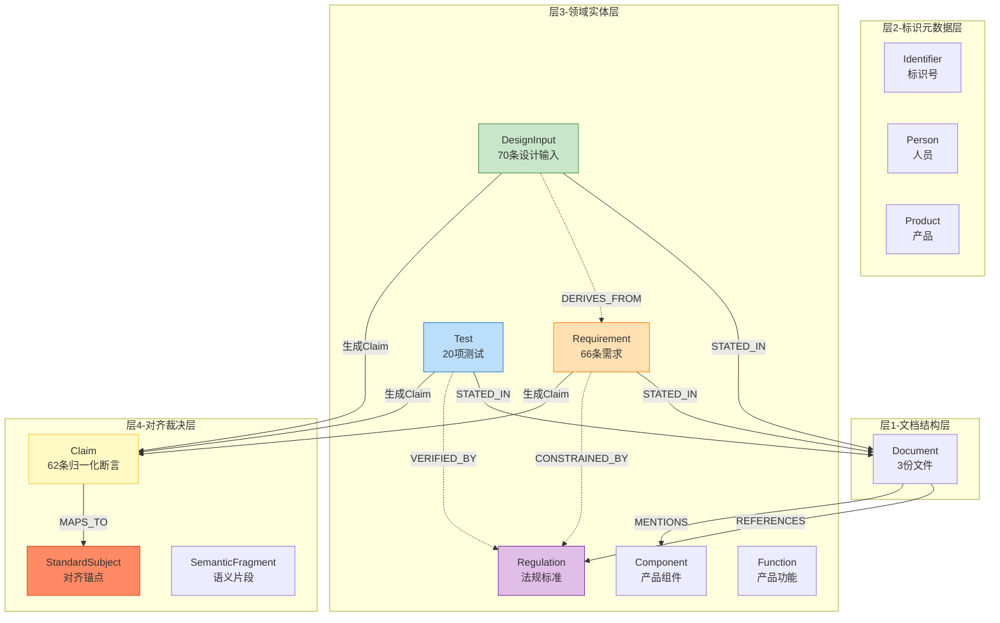
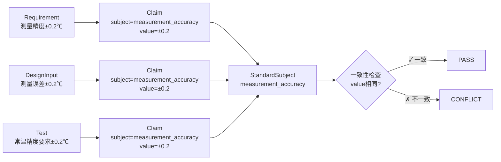

# POC 验证报告（完整 Schema 版）

> 生成时间：自动生成

> Schema 版本：技术文档 V3（14种节点类型 + 完整关系）

## 1. 概述

本次 POC 按照技术文档中定义的**完整 Schema**（4层14种节点类型）对 3 份文件进行了结构化信息抽取和跨文件对齐。

### 处理文件

| 文件 | 文档类型 | 核心实体 | 数量 |
|------|---------|---------|------|
| PT9L红外体温计检测报告 V1.0.via_lo_html.clean.md | test_report | Test | 20 |
| 客户需求书E0-血压计 23.6.via_xlsx.clean.md | customer_requirement | Requirement | 64 |
| 设计输入汇总表E0  20211118.via_xlsx.clean.md | design_input | DesignInput | 68 |

## 2. 抽取结果统计

### 2.1 各文件节点数量

| 节点类型 | 客户需求书 | 设计输入汇总表 | 检测报告 | 合计 |
|---------|-----------|-------------|---------|------|
| Requirement | 0 | 64 | 0 | 64 |
| DesignInput | 0 | 0 | 68 | 68 |
| Test | 20 | 0 | 0 | 20 |
| Regulation | 1 | 5 | 155 | 161 |
| Component | 0 | 6 | 14 | 20 |
| Function | 0 | 11 | 12 | 23 |
| Identifier | 4 | 2 | 7 | 13 |
| Person | 3 | 3 | 8 | 14 |
| Product | 2 | 2 | 3 | 7 |
| SemanticFragment | 3 | 2 | 3 | 8 |
| Relationship | 13 | 5 | 12 | 30 |

## 3. 领域实体抽取示例

### 3.1 Requirement（客户需求书）

| 分类 | 描述 | 值 | 单位 | 条件 | 来源 |
|------|------|-----|------|------|------|
| 其他 | 单箱不大于 20 Kg | 20 | Kg |  | Sheet: 客户需求书 > Row9 |
| 其他 | 长宽高之和不大于 1400 mm | 1400 | mm |  | Sheet: 客户需求书 > Row9 |
| 其他 | 最大长度尺寸不大于400 mm | 400 | mm |  | Sheet: 客户需求书 > Row9 |
| 安全 | 防尘防水：应符合IEC60529的IP22类测试（属于手持式、可穿戴式或运输中可 | IP22 | None |  | Sheet: 组件规格部分 > Row14 |
| 性能 | 温度显示范围：32.0℃～42.9℃ | 32.0-42.9 | ℃ |  | Sheet: 性能规格部分 > Row1 |
| 性能 | 显示分辨率：0.1℃ | 0.1 | ℃ |  | Sheet: 性能规格部分 > Row2 |
| 性能 | 测量误差：≥35℃且≤42℃时，±0.2℃ | ±0.2 | ℃ | ≥35℃且≤42℃ | Sheet: 性能规格部分 > Row3 |
| 性能 | 测量误差：其它温度范围，±0.3℃ | ±0.3 | ℃ | ＜35℃或＞42℃ | Sheet: 性能规格部分 > Row3 |

### 3.2 DesignInput（设计输入汇总表）

| 分类 | 描述 | 值 | 单位 | 条件 | 来源 |
|------|------|-----|------|------|------|
| 通用 | 产品型号 Model: PT9L | PT9L | None |  | Sheet:设计输入 通用 > Row 1 |
| 安全 | 防尘防水 requirements for ingress of water o | IP22 | None | 属于手持式、佩戴式或运输中可操作设备 | Sheet:设计输入 通用 > Row 19 |
| 功能 | 按键描述 - 3个按键：开机测量键、设置键、静音键 | 3 | 个 |  | Sheet:红外体温计功能规格部分 > Row 5 |
| 功能 | 错误分类显示 | 2 | 种 | 1、超出工作环境温度 2、超过量程 | Sheet: 红外体温计性能规格部分 > Row  |
| 功能 | 自动关机时间 | 15 | 秒 | 常规 | Sheet: 红外体温计性能规格部分 > Row  |
| 性能 | 温度显示范围 | 32.0～42.9 | ℃ |  | Sheet: 红外体温计性能规格部分 > Row  |
| 性能 | 显示分辨率 | 0.1 | ℃ |  | Sheet: 红外体温计性能规格部分 > Row  |
| 性能 | 测量误差 | ±0.2 | ℃ | ≥35℃且≤42℃ | Sheet: 红外体温计性能规格部分 > Row  |

### 3.3 Test（检测报告）

| 测试项 | 合格标准 | 单位 | 实测结果 | 单位 | 结论 | 条件 |
|--------|---------|------|---------|------|------|------|
| 上电自检功能 |  |  | 符合要求 |  | PASS | 室温：23℃，相对湿度：55% |
| 提示音开关 |  |  | 符合要求 |  | PASS | 室温：23℃，相对湿度：55% |
| 测量单位切换 |  |  | 符合要求 |  | PASS | 室温：23℃，相对湿度：55% |
| 测量模式切换 |  |  | 符合要求 |  | PASS | 室温：23℃，相对湿度：55% |
| 自动关机 | 15±1 | S | 符合要求 |  | PASS | 室温：23℃，相对湿度：55% |
| 温度显示范围及超温提示功能 | 32℃~42.9℃ | ℃ | 见测试记录一 |  | PASS | 室温：23℃，相对湿度：55% |
| 显示分辨率 | 0.1 | ℃ | 0.1 | ℃ | PASS | 室温：23℃，相对湿度：55% |
| 常温精度测试 | ≥35℃且≤42℃：±0.2，其它：±0.3 | ℃ | 见测试记录二 |  | PASS | 室温：23.0±2.0℃，相对湿度：50%RH±20%RH |
| 低电压提示功能 |  |  | 符合要求 |  | PASS | 室温：23℃，相对湿度：55% |
| 背光灯 |  |  | 见测试记录三 |  | PASS | 室温：24℃-26℃，相对湿度：30%-70% |

## 4. 辅助实体抽取

### 4.1 Regulation（引用标准/法规）

共抽取 **99** 个不重复标准/法规。示例：

| 标准编号 | 版本 | 说明 |
|---------|------|------|
| PT9L红外体温计产品检验标准 |  | 适用标准 |
| ROHS(2011/65/EU) | 2011/65/EU | 合规要求 |
| 加州65提案 |  | 合规要求 |
| 电池指令 (2013/56/EU) | 2013/56/EU | 合规要求 |
| 包装指令 (2005/20/EC) | 2005/20/EC | 合规要求 |
| IEC60529 |  | 适用标准 |
| FDA |  | 合规要求 |
| 加州RoHS |  | 合规要求 |
| ISO 80601-2-56:2017/Amd1:2018 | 2017/Amd1:2018 | 适用标准 |
| EN ISO 80601-2-56:2017+A1:2018 | 2017+A1:2018 | 参考依据 |
| EN 12470-3:2000+A1:2009 | 2000+A1:2009 | 参考依据 |
| EN 12470-5:2003 | 2003 | 参考依据 |

### 4.2 Component（产品组件）

共抽取 **13** 个不重复组件。

| 名称 | 类型 | 规格 |
|------|------|------|
| 上盖 | structure | 细火花纹表面处理，白色 |
| 下盖 | structure | 细火花纹表面处理，白色 |
| 电池盖 | structure | 细火花纹表面处理，白色 |
| 按键 | structure | 注塑按键，细火花纹表面处理 |
| 透镜 | optical | 模切透镜 |
| LCD显示屏 | display | 段码式，有背光 |
| PCB | pcb |  |
| 壳体 | structure | 不变色 |
| 红外体温计主机 | other |  |
| 说明书 | other | 尺寸：150x50mm（±1mm） |

### 4.3 Relationship（抽取的显式关系）

共抽取 **30** 条显式关系。

| 起点类型 | 起点ID | 关系 | 终点类型 | 终点ID |
|---------|--------|------|---------|--------|
| Test | 常温精度测试 | VERIFIED_BY | Regulation | PT9L红外体温计产品检验标准 |
| Test | 上电自检功能 | VERIFIED_BY | Regulation | PT9L红外体温计产品检验标准 |
| Test | 提示音开关 | VERIFIED_BY | Regulation | PT9L红外体温计产品检验标准 |
| Test | 测量单位切换 | VERIFIED_BY | Regulation | PT9L红外体温计产品检验标准 |
| Test | 测量模式切换 | VERIFIED_BY | Regulation | PT9L红外体温计产品检验标准 |
| Test | 自动关机 | VERIFIED_BY | Regulation | PT9L红外体温计产品检验标准 |
| Test | 温度显示范围及超温提示功能 | VERIFIED_BY | Regulation | PT9L红外体温计产品检验标准 |
| Test | 显示分辨率 | VERIFIED_BY | Regulation | PT9L红外体温计产品检验标准 |
| Test | 低电压提示功能 | VERIFIED_BY | Regulation | PT9L红外体温计产品检验标准 |
| Test | 背光灯 | VERIFIED_BY | Regulation | PT9L红外体温计产品检验标准 |
| Test | 静态电流 | VERIFIED_BY | Regulation | PT9L红外体温计产品检验标准 |
| Test | 工作电流 | VERIFIED_BY | Regulation | PT9L红外体温计产品检验标准 |
| Test | 裸机跌落测试 | VERIFIED_BY | Regulation | PT9L红外体温计产品检验标准 |
| Requirement | 要求同时满足以下环保指令或法规：ROHS | CONSTRAINED_BY | Regulation | ROHS(2011/65/EU) |
| Requirement | 要求同时满足以下环保指令或法规：加州65 | CONSTRAINED_BY | Regulation | 加州65提案 |

## 5. 归一化 Claim 与跨文件对齐

### 5.1 统计

- 总 Claims：**62**
- 成功归一化映射：**43**（69.4%）
- 跨文件对齐 subjects：**10** 个

### 5.2 跨文件参数对齐详情

以下参数在 2 份或以上文件中同时出现，可以进行一致性比对：

#### `atmospheric_pressure` （比较方向: wider_is_better，涉及 2 份文件）

| 来源实体类型 | 来源文件 | 值 | 单位 | 角色 |
|-------------|---------|-----|------|------|
| Requirement | 客户需求书E0-血压计 23.6.via_xlsx.clea | 70-106 | kPa |  |
| DesignInput | 设计输入汇总表E0  20211118.via_xlsx.c | 70～106 | kPa |  |

#### `auto_shutdown_time` （比较方向: exact_match，涉及 3 份文件）

| 来源实体类型 | 来源文件 | 值 | 单位 | 角色 |
|-------------|---------|-----|------|------|
| Test | PT9L红外体温计检测报告 V1.0.via_lo_html | 15±1 | S | expected |
| Test | PT9L红外体温计检测报告 V1.0.via_lo_html | 符合要求 | None | actual |
| Requirement | 客户需求书E0-血压计 23.6.via_xlsx.clea | 15 | 秒 |  |
| DesignInput | 设计输入汇总表E0  20211118.via_xlsx.c | 15 | 秒 |  |

#### `battery_life` （比较方向: larger_is_better，涉及 3 份文件）

| 来源实体类型 | 来源文件 | 值 | 单位 | 角色 |
|-------------|---------|-----|------|------|
| Test | PT9L红外体温计检测报告 V1.0.via_lo_html | 1000 | 次 | expected |
| Requirement | 客户需求书E0-血压计 23.6.via_xlsx.clea | 1000 | 次 |  |
| DesignInput | 设计输入汇总表E0  20211118.via_xlsx.c | 1000 | 次 |  |

#### `display_resolution` （比较方向: smaller_is_better，涉及 3 份文件）

| 来源实体类型 | 来源文件 | 值 | 单位 | 角色 |
|-------------|---------|-----|------|------|
| Test | PT9L红外体温计检测报告 V1.0.via_lo_html | 0.1 | ℃ | expected |
| Test | PT9L红外体温计检测报告 V1.0.via_lo_html | 0.1 | ℃ | actual |
| Requirement | 客户需求书E0-血压计 23.6.via_xlsx.clea | 0.1 | ℃ |  |
| DesignInput | 设计输入汇总表E0  20211118.via_xlsx.c | 0.1 | ℃ |  |

#### `humidity_range` （比较方向: wider_is_better，涉及 2 份文件）

| 来源实体类型 | 来源文件 | 值 | 单位 | 角色 |
|-------------|---------|-----|------|------|
| Requirement | 客户需求书E0-血压计 23.6.via_xlsx.clea | 15-95 | %RH |  |
| DesignInput | 设计输入汇总表E0  20211118.via_xlsx.c | 15-95 | %RH |  |

#### `ip_rating` （比较方向: exact_match，涉及 2 份文件）

| 来源实体类型 | 来源文件 | 值 | 单位 | 角色 |
|-------------|---------|-----|------|------|
| Requirement | 客户需求书E0-血压计 23.6.via_xlsx.clea | IP22 | None |  |
| DesignInput | 设计输入汇总表E0  20211118.via_xlsx.c | IP22 | None |  |

#### `measurement_accuracy` （比较方向: smaller_is_better，涉及 3 份文件）

| 来源实体类型 | 来源文件 | 值 | 单位 | 角色 |
|-------------|---------|-----|------|------|
| Test | PT9L红外体温计检测报告 V1.0.via_lo_html | ≥35℃且≤42℃：±0.2，其它：±0.3 | ℃ | expected |
| Test | PT9L红外体温计检测报告 V1.0.via_lo_html | 见测试记录二 | None | actual |
| Requirement | 客户需求书E0-血压计 23.6.via_xlsx.clea | ±0.2 | ℃ |  |
| Requirement | 客户需求书E0-血压计 23.6.via_xlsx.clea | ±0.3 | ℃ |  |
| DesignInput | 设计输入汇总表E0  20211118.via_xlsx.c | ±0.2 | ℃ |  |
| DesignInput | 设计输入汇总表E0  20211118.via_xlsx.c | ±0.3 | ℃ |  |

#### `measurement_range` （比较方向: wider_is_better，涉及 3 份文件）

| 来源实体类型 | 来源文件 | 值 | 单位 | 角色 |
|-------------|---------|-----|------|------|
| Test | PT9L红外体温计检测报告 V1.0.via_lo_html | 32℃~42.9℃ | None | expected |
| Test | PT9L红外体温计检测报告 V1.0.via_lo_html | 见测试记录一 | None | actual |
| Requirement | 客户需求书E0-血压计 23.6.via_xlsx.clea | 32.0-42.9 | ℃ |  |
| DesignInput | 设计输入汇总表E0  20211118.via_xlsx.c | 32.0～42.9 | ℃ |  |

#### `operating_temperature` （比较方向: wider_is_better，涉及 2 份文件）

| 来源实体类型 | 来源文件 | 值 | 单位 | 角色 |
|-------------|---------|-----|------|------|
| Requirement | 客户需求书E0-血压计 23.6.via_xlsx.clea | 10-40 | ℃ |  |
| Requirement | 客户需求书E0-血压计 23.6.via_xlsx.clea | 15-95 | %RH |  |
| Requirement | 客户需求书E0-血压计 23.6.via_xlsx.clea | 70-106 | kPa |  |
| Requirement | 客户需求书E0-血压计 23.6.via_xlsx.clea | -20.0-55.0 | ℃ |  |
| Requirement | 客户需求书E0-血压计 23.6.via_xlsx.clea | 2 | 种 |  |
| DesignInput | 设计输入汇总表E0  20211118.via_xlsx.c | 10～40 | ℃ |  |
| DesignInput | 设计输入汇总表E0  20211118.via_xlsx.c | 15-95 | %RH |  |
| DesignInput | 设计输入汇总表E0  20211118.via_xlsx.c | 70～106 | kPa |  |

#### `service_life` （比较方向: larger_is_better，涉及 3 份文件）

| 来源实体类型 | 来源文件 | 值 | 单位 | 角色 |
|-------------|---------|-----|------|------|
| Test | PT9L红外体温计检测报告 V1.0.via_lo_html | 10000 | 次 | expected |
| Requirement | 客户需求书E0-血压计 23.6.via_xlsx.clea | 5 | 年 |  |
| Requirement | 客户需求书E0-血压计 23.6.via_xlsx.clea | 10000 | 次 |  |
| DesignInput | 设计输入汇总表E0  20211118.via_xlsx.c | 5 | 年 |  |
| DesignInput | 设计输入汇总表E0  20211118.via_xlsx.c | 10000 | 次 |  |

## 6. 知识图谱结构（Mermaid）

## 7. 对齐流程

## 8. 与旧版 POC 对比

| 维度 | 旧版（V2 简化 schema） | 新版（完整 schema） |
|------|---------------------|-------------------|
| 节点类型 | 6种（Claim统一体） | 14种（按文档类型专属实体） |
| 核心实体 | Claim (带 claim_role 字段) | Requirement / DesignInput / Test 独立类型 |
| 专属字段 | 无（所有实体共享同一结构） | 有（如 Test.expected_value vs actual_result） |
| 追溯关系 | 隐式（通过 subject 相同） | 显式（DERIVES_FROM / VERIFIED_BY 边） |
| 对齐机制 | Claim 直接对齐 | 领域实体 → Claim → StandardSubject 三级 |
| 冲突检测精度 | 中（可能混淆测试条件与产品规格） | 高（Test.expected vs actual 天然分离） |

## 9. 结论

本次 POC 验证了：

1. **LLM 结构化抽取可行**：DeepSeek-chat + instructor 能准确按 Pydantic schema 抽取领域实体
2. **文档类型专属 schema 有效**：针对不同文件类型使用不同的抽取模型，信息保留更完整
3. **术语归一化可行**：69.4% 的 Claims 成功映射到标准词
4. **跨文件对齐可行**：10 个核心参数在 2-3 份文件中成功对齐
5. **显式关系抽取可行**：成功抽取出 DERIVES_FROM / CONSTRAINED_BY / VERIFIED_BY 等追溯关系

### 下一步（MVP）

- 导入 Neo4j 图数据库（Docker 就绪后执行 step3）
- 实现 CORRESPONDS_TO 边的自动推理
- 实现 19 条 Cypher 检查规则
- 扩展到全部 DHF 文件