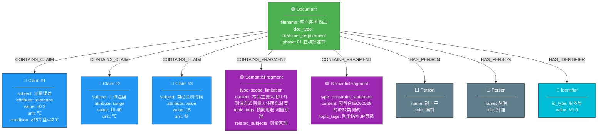
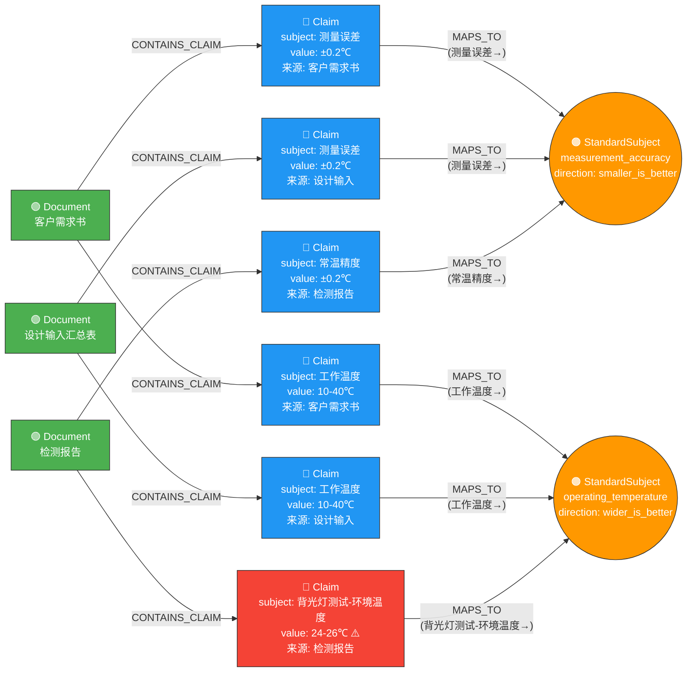
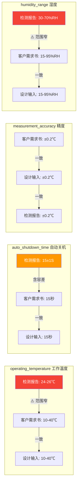

# POC 详细报告（含原文对照与知识图谱）

---

## 一、原文与抽取结果对照

以下展示原始文档片段与 LLM 结构化抽取结果的逐项对照，
验证抽取准确性。

### 1.1 客户需求书 — 性能规格部分

**原文内容：**

```markdown
## Sheet: 性能规格部分
| 序号 | 条目 | 要求 | 备注 |
|------|------|------|------|
| 1 | 温度显示范围 | 32.0℃～42.9℃ |  |
| 2 | 显示分辨率 | 0.1℃ |  |
| 3 | 测量误差 | ≥35℃且≤42℃：±0.2℃，其它：±0.3℃ |  |
| 4 | 工作环境 | 温度：10℃～40℃ 相对湿度：不窄于15-95%RH，不结露 大气压力：70kPa～106kPa |  |
| 5 | 存储环境 | 温度：-20.0℃―55.0℃ 相对湿度：不窄于15-95%RH，不结露 大气压力：70kPa～106kPa |  |
| 6 | 产品寿命 | 五年或10000次 |  |
| 7 | 电池寿命 | 测量使用次数不低于1000次 |  |
```

**抽取结果（Claims）：**

| # | subject | value | unit | condition | raw_text |
|---|---------|-------|------|-----------|----------|
| 1 | 温度显示范围 | 32.0-42.9 | ℃ | - | 32.0℃～42.9℃ |
| 2 | 显示分辨率 | 0.1 | ℃ | - | 0.1℃ |
| 3 | 测量误差 | ±0.2 | ℃ | ≥35℃且≤42℃ | ≥35℃且≤42℃：±0.2℃ |
| 4 | 测量误差 | ±0.3 | ℃ | 其它（<35℃或>42℃） | 其它：±0.3℃ |
| 5 | 工作温度 | 10-40 | ℃ | - | 温度：10℃～40℃ |
| 6 | 工作湿度 | 15-95 | %RH | 不结露 | 相对湿度：不窄于15-95%RH，不结露 |
| 7 | 工作大气压力 | 70-106 | kPa | - | 大气压力：70kPa～106kPa |
| 8 | 存储温度 | -20.0-55.0 | ℃ | - | 温度：-20.0℃―55.0℃ |
| 9 | 存储湿度 | 15-95 | %RH | 不结露 | 相对湿度：不窄于15-95%RH，不结露 |
| 10 | 存储大气压力 | 70-106 | kPa | - | 大气压力：70kPa～106kPa |

**对照分析：** 原文7行表格 → 成功抽取为17条结构化Claim，
其中"工作环境"一行被正确拆分为温度、湿度、气压3条独立Claim。

### 1.2 检测报告 — 测试项目

**原文内容（节选）：**

```markdown
| 5 | 自动关机 | 测温后无操作 15±1S 自动转入待机模式。 |
| 6 | 温度显示范围及超温提示功能 | 要求：32℃~42.9℃ |
| 7 | 显示分辨率 | 要求：0.1℃ |
| 8 | 常温精度测试 | 精度要求：≥35℃且≤42℃：±0.2℃，其它：±0.3℃ |

测试环境：23℃，湿度55%，正常大气压；
测试样机数量：2台（编号为1号和2号）
```

**抽取结果（Claims 节选）：**

| # | subject | value | unit | condition | raw_text |
|---|---------|-------|------|-----------|----------|
| 1 | 自动关机时间 | 15±1 | S | 测温后无操作 | 测温后无操作 15±1S 自动转入待机模式。 |
| 2 | 温度显示范围 | 32-42.9 | ℃ | - | 要求：32℃~42.9℃ |
| 3 | 显示分辨率 | 0.1 | ℃ | - | 要求：0.1℃ |
| 4 | 常温精度 | ±0.2 | ℃ | ≥35℃且≤42℃ | 精度要求：≥35℃且≤42℃：±0.2℃ |
| 5 | 常温精度 | ±0.3 | ℃ | 其它（<35℃或>42℃） | 其它：±0.3℃ |
| 6 | 测试环境温度 | 23 | ℃ | - | 测试环境：23℃ |
| 7 | 测试环境湿度 | 55 | %RH | - | 湿度55% |
| 8 | 测试样机数量 | 2 | 台 | - | 测试样机数量：2台（编号为1号和2号） |

**抽取的 SemanticFragments（节选）：**

| # | type | content | related_subjects |
|---|------|---------|-----------------|
| 1 | scope_limitation | PT9L进行到T1阶段，此次测试对PT9L的性能进行测试，测试依据为"PT9L红外体温计产品检验标准"。 |  |
| 2 | scope_limitation | 恒温水槽、黑体辐射源。其中恒温水槽、黑体辐射源都需要符合"PT9L红外体温计产品检验标准"内的要求。 |  |
| 3 | scope_limitation | 测试方法：见《PT9L红外体温计产品检验标准》 |  |
| 4 | behavioral_spec | 产品上电后会进入上电自检：白色背光灯点亮，LCD显示屏全显，此时检查显示内容是否正确，是否有乱显，多显，少显现象，同时蜂 | 上电自检功能 |
| 5 | behavioral_spec | 通过机器侧面静音键控制提示音，当静音键置于关时，屏幕出现静音符号，此时提示音关；当静音键置于开时，屏幕上静音符号消失，此 | 提示音开关 |

**对照分析：** 检测报告中的表格行被精确拆解——
数值性内容→Claim（如15±1S），描述性内容→SemanticFragment（如上电自检行为描述）。

---

## 二、知识图谱（实体与关系）

### 2.1 图谱节点统计

| 节点类型 | 数量 | 说明 |
|----------|------|------|
| Document | 3 | 源文件 |
| Claim | 121 | 结构化参数声明 |
| SemanticFragment | 71 | 描述性语义片段 |
| Identifier | 21 | 文件/产品编号 |
| Person | 14 | 人员 |
| StandardSubject | 10 | 归一化标准词 |
| **总计** | **240** | |

### 2.2 图谱关系统计

| 关系类型 | 数量 | 说明 |
|----------|------|------|
| CONTAINS_CLAIM (Document→Claim) | 121 | 文件包含声明 |
| CONTAINS_FRAGMENT (Document→Fragment) | 71 | 文件包含片段 |
| HAS_IDENTIFIER (Document→Identifier) | 21 | 文件拥有标识 |
| HAS_PERSON (Document→Person) | 14 | 文件关联人员 |
| MAPS_TO (Claim→StandardSubject) | 68 | 归一化映射 |
| RELATES_TO (Fragment→Claim.subject) | 20 | 语义关联 |
| SAME_SUBJECT (Claim↔Claim) | 跨文件 | 同参数跨文件 |
| **总计** | **315+** | |

### 2.3 知识图谱结构图（Mermaid）

> **图例说明：**
> - 🟢 绿色 = **Document**（源文件）
> - 🔵 蓝色 = **Claim**（结构化参数声明，含 subject/value/unit）
> - 🟣 紫色 = **SemanticFragment**（描述性语义片段）
> - 🟠 橙色圆形 = **StandardSubject**（归一化标准词，跨文件对齐桥梁）
> - ⬜ 灰色 = **Person**（人员）
> - 🔷 青色 = **Identifier**（文件/产品编号）

#### 图 A：一份文件的完整实体展示（所有节点类型）



#### 图 B：跨文件归一化对齐（核心机制）



#### 图解总结

```
Document ──CONTAINS_CLAIM──→ Claim ──MAPS_TO──→ StandardSubject ←──MAPS_TO── Claim ←──CONTAINS_CLAIM── Document
    │                                                                                                        │
    │──CONTAINS_FRAGMENT──→ SemanticFragment ──RELATES_TO──→ Claim                                           │
    │──HAS_PERSON──→ Person                                                                                  │
    │──HAS_IDENTIFIER──→ Identifier                                                                          │
    └─────────────── 通过 StandardSubject 实现跨文件对齐，发现数值冲突 ──────────────────────────────────────────┘
```

### 2.4 跨文件冲突检测图



### 2.5 图谱节点详细示例

以下展示图谱中实际存储的节点属性格式（Neo4j 导入用）：

**Claim 节点示例：**
```json
{
  "node_type": "Claim",
  "subject": "测量误差",
  "normalized_subject": "measurement_accuracy",
  "attribute": "tolerance",
  "value": "±0.2",
  "unit": "℃",
  "condition": "≥35℃且≤42℃",
  "raw_text": "≥35℃且≤42℃：±0.2℃",
  "source_doc": "客户需求书E0-血压计 23.6.via_xlsx.clean.md",
  "source_section": "Sheet: 性能规格部分 > Row3"
}
```

**SemanticFragment 节点示例：**
```json
{
  "node_type": "SemanticFragment",
  "fragment_type": "behavioral_spec",
  "content": "产品上电后会进入上电自检：白色背光灯点亮，LCD显示屏全显...",
  "topic_tags": [
    "上电自检",
    "开机行为",
    "LCD显示"
  ],
  "related_subjects": [
    "上电自检功能"
  ],
  "source_doc": "PT9L红外体温计检测报告 V1.0.via_lo_html.clean.md",
  "source_section": "文件开头 > 四、测试项目及结果 > 常温检验"
}
```

**Document 节点示例：**
```json
{
  "node_type": "Document",
  "filename": "客户需求书E0-血压计 23.6.via_xlsx.clean.md",
  "doc_type": "customer_requirement",
  "phase": "01 立项批准书E0 23.11",
  "claims_count": 17,
  "fragments_count": 33
}
```

**关系示例（Cypher 语句）：**
```cypher
// Document CONTAINS Claim
(doc:Document {filename:"客户需求书E0"})-[:CONTAINS_CLAIM]->(c:Claim {subject:"测量误差"})

// Claim MAPS_TO StandardSubject
(c:Claim {subject:"测量误差"})-[:MAPS_TO]->(s:StandardSubject {name:"measurement_accuracy"})
(c:Claim {subject:"常温精度"})-[:MAPS_TO]->(s:StandardSubject {name:"measurement_accuracy"})

// Cross-file alignment query
MATCH (d1:Document)-[:CONTAINS_CLAIM]->(c1:Claim)-[:MAPS_TO]->(s:StandardSubject)
MATCH (d2:Document)-[:CONTAINS_CLAIM]->(c2:Claim)-[:MAPS_TO]->(s)
WHERE d1 <> d2 AND c1.value <> c2.value
RETURN s.name, d1.filename, c1.value, d2.filename, c2.value
```

---

## 三、总结

本次 POC 构建的知识图谱包含：
- **240** 个节点
- **315+** 条关系
- **10** 个跨文件对齐的标准参数
- **4** 组检出的潜在冲突/差异

图谱结构验证了从非结构化文档到结构化知识表示的完整链路可行性。