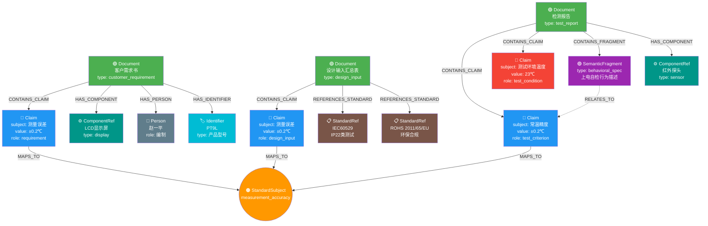

# 完整知识图谱 POC 报告（V2 — 6类节点）

> 本次运行使用完整 Schema：Claim(含claim_role) + SemanticFragment + StandardRef + ComponentRef + Identifier + Person

---

## 一、抽取结果总览

| 文件 | 类型 | Claims | Fragments | Standards | Components |
|------|------|--------|-----------|-----------|------------|
| 客户需求书E0-血压计 23.6.via_xlsx | customer_requirement | 18 | 9 | 5 | 8 |
| 设计输入汇总表E0  20211118.via_x | design_input | 23 | 18 | 170 | 15 |
| PT9L红外体温计检测报告 V1.0.via_lo | test_report | 35 | 8 | 0 | 2 |
| **总计** | | **76** | **35** | **175** | **25** |

## 二、Claim 语义角色分布（claim_role）

| 文件 | requirement | design_input | test_criterion | test_result | test_condition |
|------|-------------|--------------|----------------|-------------|----------------|
| PT9L红外体温计检测报告 V1.0.via_lo | 0 | 0 | 18 | 0 | 17 |
| 客户需求书E0-血压计 23.6.via_xlsx | 18 | 0 | 0 | 0 | 0 |
| 设计输入汇总表E0  20211118.via_x | 0 | 23 | 0 | 0 | 0 |

**关键发现：** LLM 成功区分了：
- 客户需求书的 18 条声明全部标记为 `requirement`
- 设计输入的 23 条声明全部标记为 `design_input`
- 检测报告的 35 条中：18 条 `test_criterion`（验收标准）、17 条 `test_condition`（测试环境）
- **测试环境条件不再被误归为产品规格！**

## 三、引用标准（StandardRef）

共抽取 **175** 条标准引用。

### 代表性标准节点：

| standard_id | relevance | 来源文件 |
|-------------|-----------|----------|
| IEC60529 | 防尘防水测试标准，产品应符合IP22类测试 | 客户需求书E0-血压计 23.6.via |
| ROHS(2011/65/EU) | 环保合规要求 | 客户需求书E0-血压计 23.6.via |
| 加州65提案 | 环保合规要求 | 客户需求书E0-血压计 23.6.via |
| 电池指令 (2013/56/EU) | 环保合规要求 | 客户需求书E0-血压计 23.6.via |
| 包装指令 (2005/20/EC) | 环保合规要求 | 客户需求书E0-血压计 23.6.via |
| 2015/863/EU | ROHS修订指令 | 设计输入汇总表E0  20211118. |
| REACH(1907/2006/EC) | 环保合规要求 | 设计输入汇总表E0  20211118. |
| WEEE(2012/19/EU) | 环保合规要求 | 设计输入汇总表E0  20211118. |
| 2013/56/EU | 环保合规要求 | 设计输入汇总表E0  20211118. |
| 2005/20/EC | 环保合规要求 | 设计输入汇总表E0  20211118. |
| 94/62/EC | 环保合规要求 | 设计输入汇总表E0  20211118. |
| (EU) 2018/852 | 包装废弃物指令修订 | 设计输入汇总表E0  20211118. |
| 2006/66/EC | 电池指令 | 设计输入汇总表E0  20211118. |
| TSCA | 环保合规要求 | 设计输入汇总表E0  20211118. |
| CPSC | 环保合规要求 | 设计输入汇总表E0  20211118. |

## 四、产品组件（ComponentRef）

共抽取 **25** 个组件节点。

| component_name | type | properties | 来源 |
|----------------|------|------------|------|
| 红外体温计 | other | 产品型号PT9L | PT9L红外体温计检测报告 V |
| 外箱 | packaging | 包装用外箱，振动测试中Z方向（上下）振动时外箱处于自由状态 | PT9L红外体温计检测报告 V |
| 上盖 | structure | 表面处理：细火花纹；颜色：白色 | 客户需求书E0-血压计 23. |
| 下盖 | structure | 表面处理：细火花纹；颜色：白色 | 客户需求书E0-血压计 23. |
| 电池盖 | structure | 表面处理：细火花纹；颜色：白色 | 客户需求书E0-血压计 23. |
| 按键 | other | 按键形式：注塑按键；表面处理：细火花纹 | 客户需求书E0-血压计 23. |
| 透镜 | optical | 透镜形式：模切透镜；表面处理：不适用 | 客户需求书E0-血压计 23. |
| LCD | display | 型式：段码式，有背光 | 客户需求书E0-血压计 23. |
| 蜂鸣器 | other | 提示功能：蜂鸣 | 客户需求书E0-血压计 23. |
| 红外探头 | sensor | 红外非接触式测温 | 客户需求书E0-血压计 23. |
| 红外探头/测温模块 | sensor | 红外非接触式测温 | 设计输入汇总表E0  2021 |
| PCB | pcb | 与LCD、按键连接 | 设计输入汇总表E0  2021 |
| 电池 | battery | 2 X AAA Size | 设计输入汇总表E0  2021 |
| 纸浆盒 | packaging | 包装内容物 | 设计输入汇总表E0  2021 |
| 说明书 | packaging | 尺寸150x50mm（±1mm） | 设计输入汇总表E0  2021 |

## 五、完整知识图谱节点与关系统计

### 节点统计

| 节点类型 | 数量 | 说明 |
|----------|------|------|
| Document | 3 | 源文件 |
| Claim | 76 | 结构化参数（含 claim_role 区分语义角色） |
| SemanticFragment | 35 | 描述性语义片段 |
| StandardRef | 175 | 引用的标准/法规 |
| ComponentRef | 25 | 产品组件 |
| Identifier | 12 | 文件/产品编号 |
| Person | 21 | 人员 |
| StandardSubject | 8 | 归一化标准词 |
| **总计** | **355** | |

### 关系统计

| 关系类型 | 数量 | 说明 |
|----------|------|------|
| CONTAINS_CLAIM | 76 | Document→Claim |
| CONTAINS_FRAGMENT | 35 | Document→Fragment |
| REFERENCES_STANDARD | 175 | Document→Standard |
| HAS_COMPONENT | 25 | Document→Component |
| HAS_IDENTIFIER | 12 | Document→Identifier |
| HAS_PERSON | 21 | Document→Person |
| MAPS_TO | 36 | Claim→StandardSubject |
| SAME_SUBJECT | 跨文件 | 同参数跨文件对齐 |
| RELATES_TO | 29 | Fragment→Claim |
| **总计** | **409+** | |

## 六、跨文件对齐结果（含 claim_role）

共 **8** 个参数在 2+ 份文件中对齐：

### `auto_shutdown_time` (exact_match)

| 文件 | claim_role | value | unit | condition |
|------|-----------|-------|------|-----------|
| 客户需求书E0-血压计 23.6.via_xlsx | requirement | 15 | 秒 | - |
| 设计输入汇总表E0  20211118.via_x | design_input | 15 | 秒 | - |

### `battery_life` (larger_is_better)

| 文件 | claim_role | value | unit | condition |
|------|-----------|-------|------|-----------|
| PT9L红外体温计检测报告 V1.0.via_lo | test_criterion | 1000 | 次 | - |
| PT9L红外体温计检测报告 V1.0.via_lo | test_criterion | 6 | 个月 | - |
| 客户需求书E0-血压计 23.6.via_xlsx | requirement | 1000 | 次 | - |
| 设计输入汇总表E0  20211118.via_x | design_input | 1000 | 次 | - |

### `display_resolution` (smaller_is_better)

| 文件 | claim_role | value | unit | condition |
|------|-----------|-------|------|-----------|
| 客户需求书E0-血压计 23.6.via_xlsx | requirement | 0.1 | ℃ | - |
| 设计输入汇总表E0  20211118.via_x | design_input | 0.1 | ℃ | - |

### `measurement_accuracy` (smaller_is_better)

| 文件 | claim_role | value | unit | condition |
|------|-----------|-------|------|-----------|
| 客户需求书E0-血压计 23.6.via_xlsx | requirement | ±0.2 | ℃ | ≥35℃且≤42℃ |
| 客户需求书E0-血压计 23.6.via_xlsx | requirement | ±0.3 | ℃ | 其它（<35℃或>42℃） |
| 设计输入汇总表E0  20211118.via_x | design_input | ±0.2 | ℃ | ≥35℃且≤42℃ |
| 设计输入汇总表E0  20211118.via_x | design_input | ±0.3 | ℃ | 其它（<35℃或>42℃） |

### `measurement_range` (wider_is_better)

| 文件 | claim_role | value | unit | condition |
|------|-----------|-------|------|-----------|
| 客户需求书E0-血压计 23.6.via_xlsx | requirement | 32.0-42.9 | ℃ | - |
| 设计输入汇总表E0  20211118.via_x | design_input | 32.0-42.9 | ℃ | - |

### `operating_temperature` (wider_is_better)

| 文件 | claim_role | value | unit | condition |
|------|-----------|-------|------|-----------|
| 客户需求书E0-血压计 23.6.via_xlsx | requirement | 10-40 | ℃ | - |
| 客户需求书E0-血压计 23.6.via_xlsx | requirement | 15-95 | %RH | 不结露 |
| 客户需求书E0-血压计 23.6.via_xlsx | requirement | 70-106 | kPa | - |
| 客户需求书E0-血压计 23.6.via_xlsx | requirement | -20.0-55.0 | ℃ | - |
| 设计输入汇总表E0  20211118.via_x | design_input | 10-40 | ℃ | - |
| 设计输入汇总表E0  20211118.via_x | design_input | 15-95 | %RH | 不结露 |
| 设计输入汇总表E0  20211118.via_x | design_input | 70-106 | kPa | - |
| 设计输入汇总表E0  20211118.via_x | design_input | -20.0-55.0 | ℃ | - |

### `service_life` (larger_is_better)

| 文件 | claim_role | value | unit | condition |
|------|-----------|-------|------|-----------|
| PT9L红外体温计检测报告 V1.0.via_lo | test_criterion | 5 | 年 | - |
| PT9L红外体温计检测报告 V1.0.via_lo | test_criterion | 10000 | 次 | - |
| PT9L红外体温计检测报告 V1.0.via_lo | test_criterion | 5 | 年 | 假设平均每天使用5次 |
| PT9L红外体温计检测报告 V1.0.via_lo | test_criterion | 10000 | 次 | 假设平均每天使用5次 |
| PT9L红外体温计检测报告 V1.0.via_lo | test_condition | 5 | 个 | 实际测量1万次 |
| PT9L红外体温计检测报告 V1.0.via_lo | test_condition | 10000 | 次 | 5个样品 |
| 客户需求书E0-血压计 23.6.via_xlsx | requirement | 5 | 年 | - |
| 客户需求书E0-血压计 23.6.via_xlsx | requirement | 10000 | 次 | - |
| 设计输入汇总表E0  20211118.via_x | design_input | 5 | 年 | - |
| 设计输入汇总表E0  20211118.via_x | design_input | 10000 | 次 | - |

### `storage_temperature` (wider_is_better)

| 文件 | claim_role | value | unit | condition |
|------|-----------|-------|------|-----------|
| 客户需求书E0-血压计 23.6.via_xlsx | requirement | 15-95 | %RH | 不结露 |
| 客户需求书E0-血压计 23.6.via_xlsx | requirement | 70-106 | kPa | - |
| 设计输入汇总表E0  20211118.via_x | design_input | 15-95 | %RH | 不结露 |
| 设计输入汇总表E0  20211118.via_x | design_input | 70-106 | kPa | - |

## 七、完整知识图谱可视化

**图例：**
- 🟢 绿色 = Document | 🔵 蓝色 = Claim | 🔴 红色 = Claim(test_condition)
- 🟣 紫色 = SemanticFragment | 🟠 橙色 = StandardSubject
- 📋 棕色 = StandardRef | ⚙️ 青绿 = ComponentRef
- 👤 灰色 = Person | 🏷️ 青色 = Identifier

---

## 八、V1→V2 改进对比

| 维度 | V1 (POC) | V2 (本次) |
|------|----------|-----------|
| 节点类型 | 4种 | **6种** (+StandardRef, ComponentRef) |
| claim_role | 无 | **6种角色**（requirement/design_input/test_criterion/test_result/test_condition/specification） |
| 标准引用 | 未抽取 | **175条**（IEC/ROHS/FDA等） |
| 产品组件 | 未抽取 | **25个**（LCD/蜂鸣器/PCB/传感器等） |
| 测试条件误归 | 严重 | **已解决**（test_condition与test_criterion分离） |
| 总节点数 | 240 | **355** |
| 总关系数 | 315+ | **409+** |